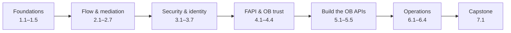

# Apigee X for Spring Boot Developers

!!! bottomline "Bottom line"
    In **33 atomic sessions** you go from *"I build Spring Boot microservices but have never touched Apigee"* to shipping a **FAPI-secured UK Open Banking** API surface on **Apigee X** — and you get there by mapping *every* Apigee concept onto something you already know in Spring.

<p class="lead">A from-the-basics course for experienced Java / Spring Boot developers. The lens is the <strong>Spring bridge</strong>: each session opens by connecting an Apigee idea to a Spring one you already use — then shows exactly where that analogy holds, and where it breaks. The worked domain throughout is <strong>UK Open Banking (OBIE) under the FAPI 1.0 Advanced</strong> security profile, with copy-pasteable code in every session and a hands-on lab in a free Apigee X evaluation org.</p>

## How this course is built

Three rules keep it learnable:

- **MINTO / answer-first.** Every session opens with its **bottom line** — the one thing you'll be able to do — then supports it. No burying the lede.
- **MECE.** The seven parts are *mutually exclusive* (no concept taught twice) and *collectively exhaustive* (together they cover Apigee X as it applies to regulated banking APIs).
- **Atomic, but cumulative.** Each session is self-contained — one objective, one lab, one stretch goal — yet explicitly **builds on** the one before. The thread runs: passthrough proxy → flow model → entitlement chain → FAPI → real Open Banking APIs → operated platform → capstone.



## The Spring bridge

You already centralise cross-cutting concerns — auth, rate limiting, CORS, error shaping — somewhere. In a Spring service that's filters, `@ControllerAdvice`, Resilience4j, and a pile of config. Apigee X is where those concerns move **out of every service and into one configured edge**. This course never teaches a policy in the abstract; it names the Spring thing you'd reach for, then shows the Apigee equivalent and its limits.

!!! bridge "Spring Boot bridge"
    Think of Apigee X as **Spring Cloud Gateway you operate as a product** — except you *configure* behaviour with policies instead of *coding* filters, and the platform owns scaling, analytics, the developer portal, and the OAuth server for you.

## Explore the curriculum

Every card is a session. Click in, or track your progress — completion ticks are saved in your browser as you mark sessions done.

```widget
{"type":"curriculummap"}
```

## What you need

- A Google Cloud account with billing enabled — an Apigee X **evaluation** org is free for 60 days (you set one up in session 1.2).
- Working Java / Spring Boot experience. Comfort with HTTP, REST, JSON, and the basics of OAuth 2.0. **No prior Apigee experience assumed.**
- A terminal with `gcloud`, `curl`, and (from session 1.2) `apigeecli`. The course installs these.

!!! note "Conventions"
    Every code block has a **Copy** button. Commands assume `bash` / `zsh`. Replace placeholders like `$PROJECT_ID`, `$ORG`, and `$ENV` with your own values. XML snippets are Apigee policy or proxy configuration.

---

<small>An independent learning resource. "Apigee" and "Google Cloud" are marks of Google. "Open Banking" specifications belong to the Open Banking Implementation Entity (OBIE). Always validate against the current official specifications before production use. "Apolaki" names the visual theme only.</small>
