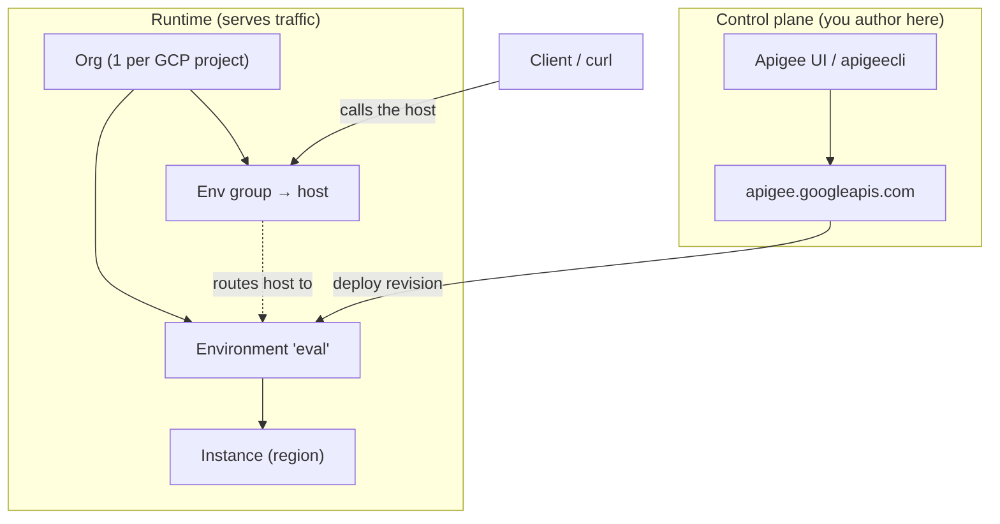

# 1.2 — Architecture & your free evaluation org

!!! bottomline "Bottom line"
    Apigee X is split into a **control plane** you talk to (the management API and UI, where you author and deploy config) and a **runtime** that actually serves traffic — and your config lives in a four-level hierarchy: **org → environment → environment group → instance**. By the end of this session you'll have provisioned a **free evaluation org** and exported the four variables — `$ORG`, `$ENV`, `$TOKEN`, `$RUNTIME_HOST` — that every lab in this course depends on.

## Why this exists

In Spring, "where does this run" is mostly an application concern: a profile (`application-prod.yml`), a deployment target (a pod, a VM), and an ingress hostname someone in platform-eng set up. The split between *config you write* and *infrastructure that runs it* exists, but it's loose — you bake the config into the jar and ship them together.

Apigee makes that split **structural and first-class**. The thing you author against (the control plane) is a different system from the thing that serves the request (the runtime). You never SSH into the runtime; you `POST` declarative config to the control plane, and Apigee propagates it. This is why "deploy" in Apigee means *make the control plane tell every runtime instance to load this revision* — not "copy a jar onto a box."

The hierarchy exists for the same reason you have profiles and namespaces: you need the **same proxy** to behave differently in dev versus prod (different backends, different quotas, different hostnames) without forking the code. Apigee gives you platform objects — **environments** for isolation, **environment groups** for routing, **instances** for where the runtime physically lives — instead of a pile of YAML conventions.

!!! bridge "Spring Boot bridge"
    Think Spring profiles and deployment targets — but promoted to **platform objects you manage**, not strings in application config. The mapping is close enough to lean on, as long as you remember these are real, addressable resources with their own lifecycle:

    | Spring concept | Apigee X object | What it owns |
    |---|---|---|
    | A profile (`dev`, `prod`) | **Environment** | An isolated deployment scope: proxies, target servers, KVMs, keystores |
    | The maven/gradle deploy step hitting an env | **Control plane** API / `apigeecli` | Where you create and deploy config |
    | The running JVM serving requests | **Runtime instance** | The managed pods that actually execute your proxies |
    | Ingress host → routes to a profile's pods | **Environment group** | Maps a hostname to one or more environments |
    | `${server.address}` you curl | **`$RUNTIME_HOST`** | The env-group hostname clients hit |

!!! breaks "Where the analogy breaks"
    A Spring profile is just a *selector* — it picks which beans and properties activate inside one running app. An Apigee **environment** is a hard isolation boundary: a proxy deployed to `eval` genuinely does not exist in another environment until you deploy it there, and its KVMs, keystores, and target servers are scoped to that environment and invisible across the line. There's also no Spring equivalent for the **environment group**: in Spring, hostname-to-app routing is your ingress controller's job, living outside the framework. In Apigee, routing a hostname to an environment is config *inside the platform itself*. Treating environments as "just a profile flag" is how people accidentally expect a proxy or a secret to be visible where it was never deployed.

## The concept

Two planes, four levels. The **control plane** is everything you author and call: the management API at `apigee.googleapis.com`, the Apigee UI, and `apigeecli`. The **runtime** is the data path — managed instances that load your deployed revisions and serve real traffic on the env-group hostname. You operate the control plane; Google operates the runtime.

The configuration hierarchy nests like this — an org contains environments; environment groups map hostnames onto environments; instances are the physical runtime footprint:



Read it as: you `deploy` a proxy revision into an **environment** via the control plane; a **client** hits the **environment group's** hostname (`$RUNTIME_HOST`), which routes to that environment running on an **instance**. The org is the top-level container — one per GCP project — and for the eval tier you get a single environment and a single environment group out of the box. The names you choose here become `$ORG`, `$ENV`, and (via the env group) `$RUNTIME_HOST`.

!!! pitfall "Watch out"
    These are two different hostnames and mixing them up is the most common early stumble. `apigee.googleapis.com` is the **control plane** — where you author and deploy config — while `$RUNTIME_HOST` (the env-group hostname) is the only place your proxies actually serve traffic. Curling the management API expecting your proxy's response gets you a `404`, not your backend.

## Hands-on lab

<div class="lab" markdown="1">
#### Lab — provision your free eval org and export the four variables

This is the bootstrap every later lab assumes. You need a Google Cloud project with billing enabled (the **eval** org itself is free — no charge for the evaluation tier — but the GCP project still requires a billing account attached).

**1. Install the two tools.** `gcloud` is the Google Cloud CLI; `apigeecli` is the community Apigee CLI you'll use throughout.

```bash
# gcloud — see cloud.google.com/sdk/docs/install for your OS
gcloud version

# apigeecli — one-line installer
curl -L https://raw.githubusercontent.com/apigee/apigeecli/main/downloadLatest.sh | sh -
export PATH=$PATH:$HOME/.apigeecli/bin
apigeecli -v
```

**2. Pick a project and authenticate.** Set the project you'll host Apigee in, then log in so both tools have credentials. The Apigee org name **is** the GCP project id:

```bash
export PROJECT_ID="my-apigee-eval"          # your GCP project id
gcloud auth login
gcloud config set project "$PROJECT_ID"
export ORG="$PROJECT_ID"                     # the Apigee org name == the project id
```

!!! pitfall "Watch out"
    The Apigee org name **is** the GCP project id — not a friendly display name you invent. Set `ORG="$PROJECT_ID"` and don't second-guess it; a made-up org name makes every later `apigeecli` call return `404 organization not found`, and the error won't point you back to this line.

**3. Enable the Apigee APIs** on the project (the control plane and the services it needs):

```bash
gcloud services enable apigee.googleapis.com \
  compute.googleapis.com servicenetworking.googleapis.com \
  --project "$PROJECT_ID"
```

**4. Provision the evaluation org.** The simplest, least error-prone path is the **UI wizard**: open `https://apigee.google.com/`, choose your project, and select **"Evaluation"** when prompted for the provisioning type. It stands up the org, one environment, one environment group, and a runtime instance for you (provisioning takes ~30–45 minutes — let it finish). The wizard lets you name the environment and env group; note both names.

!!! pitfall "Watch out"
    Provisioning takes **30–45 minutes** and the runtime **instance comes up last**, so the org can look "ready" while `$RUNTIME_HOST` is still empty. Don't read back the hostname in step 5 until the UI shows the instance as active — a curl against an empty `$RUNTIME_HOST` just times out and looks like a broken bootstrap when nothing is actually wrong.

If you prefer the CLI, eval provisioning is a single `apigeecli` call that wires up org + env + env group + instance:

```bash
apigeecli orgs create --org "$ORG" --reg us-central1 \
  --net default --runtimetype CLOUD \
  --token "$(gcloud auth print-access-token)"
```

**5. Discover and export the four variables.** Once provisioning is complete, read back the environment and env-group hostname rather than guessing them:

```bash
# token — short-lived; re-run this whenever calls start 401-ing
export TOKEN="$(gcloud auth print-access-token)"

# the environment name (eval orgs typically have exactly one)
export ENV="$(apigeecli envs list --org "$ORG" --token "$TOKEN" | jq -r '.[0]')"

# the env-group hostname clients actually hit
export RUNTIME_HOST="$(apigeecli environments groups list --org "$ORG" --token "$TOKEN" \
  | jq -r '.environmentGroups[0].hostnames[0]')"

echo "ORG=$ORG  ENV=$ENV  RUNTIME_HOST=$RUNTIME_HOST"
```

**What success looks like:** `apigeecli orgs get --org "$ORG" --token "$TOKEN"` returns your org's JSON (its `name`, runtime type `CLOUD`, analytics region) without an error, and `echo $RUNTIME_HOST` resolves to a real hostname such as `eval-group.xxxx.nip.io` or your custom domain — not an empty string. When both are true, your bootstrap is done and every later lab will "just work."
</div>

## Verify it

You should see `apigeecli orgs get --org "$ORG" --token "$TOKEN"` print a JSON object whose `name` equals your `$ORG` and whose `runtimeType` is `CLOUD`. Listing environments should show at least one entry — your `$ENV`. The value in `$RUNTIME_HOST` should be non-empty and resolvable.

A quick end-to-end smoke test that the runtime hostname is live — you'll get a `404` because no proxy is deployed yet, and that is the *correct* answer, because it proves the runtime is reachable:

```bash
echo "Org:   $ORG"
echo "Env:   $ENV"
echo "Host:  $RUNTIME_HOST"
curl -s -o /dev/null -w "runtime reachable, status=%{http_code}\n" "https://$RUNTIME_HOST/"
```

A `404` (or `403`) from the runtime host means DNS resolves and the runtime is serving — you just haven't deployed anything yet. You deploy your first proxy in **1.3**.

!!! failure "Common failure modes"
    - **Billing not enabled on the project.** Provisioning fails or stalls with a permissions/quota error. Symptom: the UI wizard greys out "Evaluation," or `gcloud services enable` reports a billing requirement. Attach a billing account first — the eval org is free, the project still needs billing.
    - **Provisioning looks finished but isn't.** Eval provisioning takes 30–45 minutes; the instance comes up last. Symptom: `$RUNTIME_HOST` is empty or curl to it times out. Wait until the UI shows the instance as ready before reading the hostname.
    - **Expired token.** `$TOKEN` from `gcloud auth print-access-token` lives ~60 minutes. Symptom: control-plane calls suddenly return `401 UNAUTHENTICATED` mid-session. Just re-run `export TOKEN="$(gcloud auth print-access-token)"`.
    - **Wrong org name.** The Apigee org name **is** the GCP project id — not a display name you invent. Symptom: `orgs get` returns `404` / "organization not found." Set `ORG="$PROJECT_ID"`.
    - **Confusing the control-plane host with the runtime host.** `apigee.googleapis.com` is where you author; `$RUNTIME_HOST` is where clients call. Symptom: curling `apigee.googleapis.com` for a proxy returns 404, because proxies serve on the env-group hostname, not the management API.

!!! stretch "Stretch goal"
    Take your own app's `dev` / `staging` / `prod` Spring profiles and diagram how they'd map onto Apigee. Decide: is each profile its own **environment**, or do some share one? Which hostnames would each **environment group** own, and would `staging` and `prod` share a group or stay isolated? Then note the one thing that *doesn't* transfer cleanly — usually a profile that toggles in-process behaviour (a feature flag, a mock bean) with no environment-level equivalent — and decide where that logic would live at the edge instead.

## Recap & next

You now hold the platform's shape: a **control plane** you author against and a **runtime** that serves traffic, configured through the **org → environment → environment group → instance** hierarchy — the grown-up, first-class version of Spring profiles and deployment targets. You've provisioned a free eval org and exported `$ORG`, `$ENV`, `$TOKEN`, and `$RUNTIME_HOST`, the four variables every lab from here on relies on.

**Next — 1.3:** put that org to work — you'll create, deploy, and call your first **passthrough reverse proxy**, the no-code equivalent of a `@RestController` that just forwards to a downstream service.
