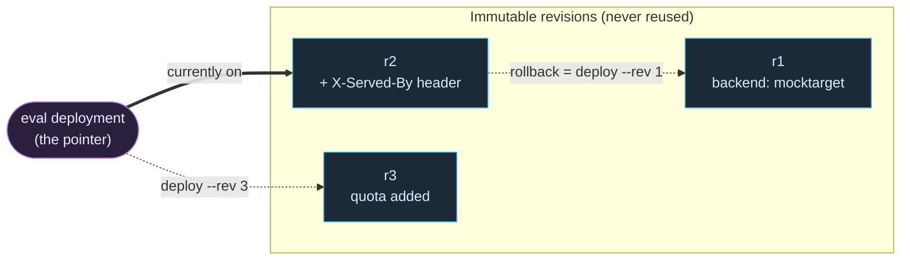

# 1.4 — Revisions, deploy & rollback

!!! bottomline "Bottom line"
    Every time you import a proxy bundle, Apigee freezes it into a numbered **revision** — an immutable snapshot, exactly like a tagged container image. **Deploying** doesn't build anything; it just points an environment at a revision. By the end you can promote a new revision and roll back to the previous one in a single command, proving both with a `curl` — without rebuilding.

## Why this exists

You already separate "the artifact" from "what's running." You build `acme-service:1.4.0` once, push it to a registry, and your environments each point at *some* tag. A rollback isn't a rebuild — it's `kubectl set image ... =:1.3.0`, flip the pointer back to a known-good artifact you already have. The build and the deploy are different events with different blast radii.

Apigee works the same way, and for the same reason: you want a deploy to be a *cheap, reversible pointer move*, not a recompile. When you `apis create bundle`, the platform stores an immutable revision — r1, r2, r3 — and never mutates one in place. **Deploying** an environment to a revision is the pointer. That decoupling is what makes rollback safe: the old revision is still sitting there, byte-for-byte, ready to be re-pointed.

This matters more for a gateway than for a service, because a bad proxy revision can take down *every* API behind it at once. You want the muscle memory of "ship forward, and if it's wrong, point back" before you have anything important behind the proxy.

!!! bridge "Spring Boot bridge"
    The split is the one you already live by — build once, deploy a tag:

    | Container / k8s world | Apigee X |
    |---|---|
    | `docker build -t proxy:r2 .` | `apigeecli apis create bundle …` → mints **revision 2** |
    | An immutable image in a registry | An immutable **revision** in the org |
    | `kubectl set image deploy/x =:r2` | `apigeecli apis deploy --rev 2` |
    | The running ReplicaSet | The **deployment** (env → revision binding) |
    | `kubectl rollout undo` to the prior tag | `apis deploy --rev 1 --ovr` |

    "Revision" is the *what* (an artifact); "deployment" is the *where it's running* (an env pointing at one). Confusing the two is the root of most deploy mistakes here.

!!! breaks "Where the analogy breaks"
    Container tags are mutable by convention — nothing stops you re-pushing `:latest` or even `:1.3.0` over a different image. Apigee revisions are **strictly monotonic and never reused**: you cannot overwrite r2, and the next import is always r3, even if it's identical to r1. There's also no "build" step that can fail differently from the deploy — `create bundle` validates the XML at import time, so a broken policy is rejected when the revision is *minted*, not when it's deployed. And unlike k8s, an environment binds to exactly **one** revision of a given proxy at a time — there's no canary "30% on r2" at this layer (you'd do that with environments or routing, later in the course).

## The concept

A revision is the entire `apiproxy/` bundle — ProxyEndpoint, TargetEndpoint, every policy — frozen and stamped with an integer. Importing again mints the *next* integer; the platform never edits an existing one. An **environment** then has a deployment: a binding that says "in `eval`, this proxy serves revision N." Moving that binding forward is a deploy; moving it back is a rollback. Same operation, opposite direction.



Read it as: the three revisions on the left are fixed artifacts. The pointer on the right is the only thing that moves. **Deploy** = aim it at a higher number; **rollback** = aim it at a lower one. Both are pointer moves, both are instant, neither rebuilds. Crucially, rolling back to r1 does not *delete* r2 — it's still there, so you can roll *forward* again the moment you've fixed the real problem.

!!! pitfall "Watch out"
    Importing (`apis create bundle`) is **not** deploying — it mints a new immutable revision but moves no pointer, so live traffic is unchanged until you `apis deploy`. And because revisions are immutable, "rollback" means *deploy an older revision*, never edit a deployed one in place. Coming from Spring, the instinct to "just fix the running thing" doesn't exist here: you ship a new revision forward or re-point at an existing one.

## Hands-on lab

<div class="lab" markdown="1">
#### Lab — promote to r2, then roll back to r1

You'll take the passthrough proxy from **1.3**, change one observable behaviour to create r2, deploy it, prove the change with `curl`, then roll back to r1 and prove the *old* behaviour returns — all without re-importing a bundle.

**Prereqs:** the `hello-proxy` from 1.3 deployed as r1, with `$ORG`, `$ENV`, `$TOKEN`, and `$RUNTIME_HOST` exported.

**1. Confirm where you stand.** List the revisions that exist and which one `eval` is actually serving:

```bash
# all revisions of this proxy (the artifacts that exist)
apigeecli apis list --name hello-proxy --org "$ORG" --token "$TOKEN" | jq '.revision'

# what eval is pointing at right now (the deployment)
apigeecli apis listdeploy --name hello-proxy --org "$ORG" --token "$TOKEN"
```

You should see revision `["1"]` and a deployment of `revision: "1"` in `eval`.

**2. Make one observable change** so r2 differs from r1. Add a single `AssignMessage` that stamps a response header. Save as `apiproxy/policies/AM-ServedBy.xml`:

```xml
<AssignMessage name="AM-ServedBy">
  <Set>
    <Headers>
      <Header name="X-Served-By">revision-2</Header>
    </Headers>
  </Set>
</AssignMessage>
```

Attach it in the ProxyEndpoint **response** PreFlow in `apiproxy/proxies/default.xml`:

```xml
<ProxyEndpoint name="default">
  <PreFlow name="PreFlow">
    <Request/>
    <Response>
      <Step><Name>AM-ServedBy</Name></Step>
    </Response>
  </PreFlow>
  <HTTPProxyConnection><BasePath>/v1/hello</BasePath></HTTPProxyConnection>
  <RouteRule name="default"><TargetEndpoint>default</TargetEndpoint></RouteRule>
</ProxyEndpoint>
```

**3. Import the new bundle — this mints revision 2.** Note that `create bundle` does *not* deploy; it only stores the artifact:

```bash
apigeecli apis create bundle --name hello-proxy \
  --proxy-folder ./hello-proxy/apiproxy \
  --org "$ORG" --token "$TOKEN"
# → response shows "revision": "2"
```

Re-list and confirm both revisions now exist, but `eval` is *still on r1*:

```bash
apigeecli apis list --name hello-proxy --org "$ORG" --token "$TOKEN" | jq '.revision'
# → ["1","2"]
apigeecli apis listdeploy --name hello-proxy --org "$ORG" --token "$TOKEN"
# → still revision: "1"   (minting a revision changed nothing live)
```

!!! pitfall "Watch out"
    This is the moment the build/deploy split bites: r2 now *exists* but `eval` is still serving r1, and a `curl` will show the old behaviour. If you skip the deploy below and conclude "my change didn't work," you've confused minting with deploying. The artifact list (`apis list`) and the live pointer (`apis listdeploy`) move independently.

**4. Deploy r2 — move the pointer forward.** `--ovr` lets the new revision *override* the currently-deployed one (Apigee otherwise refuses to leave two revisions deployed); `--wait` blocks until the deployment is actually live:

```bash
apigeecli apis deploy --name hello-proxy --rev 2 \
  --org "$ORG" --env "$ENV" --ovr --wait --token "$TOKEN"
```

Prove the new behaviour:

```bash
curl -s -D - -o /dev/null "https://$RUNTIME_HOST/v1/hello/json" | grep -i x-served-by
# → X-Served-By: revision-2
```

**5. Roll back to r1 — move the pointer back.** Identical command, lower revision number. This is the whole rollback: re-point `eval` at the artifact you already have:

```bash
apigeecli apis deploy --name hello-proxy --rev 1 \
  --org "$ORG" --env "$ENV" --ovr --wait --token "$TOKEN"
```

!!! pitfall "Watch out"
    `--ovr` is what *replaces* the deployed r2 with r1 — Apigee refuses to leave two revisions of the same proxy deployed, so without `--ovr` this rollback is rejected with a conflict, not silently queued. Also note this re-points, it doesn't delete: r2 still exists and `undeploy` would only detach a revision, never remove the artifact.

Prove the old behaviour returned — the header is gone, because r1 never had the policy:

```bash
curl -s -D - -o /dev/null "https://$RUNTIME_HOST/v1/hello/json" | grep -i x-served-by
# → (no output — r1 doesn't set the header)
```

**What success looks like:** after step 4, `curl` shows `X-Served-By: revision-2`; after step 5, the same `curl` shows *no* `X-Served-By` header at all. You changed live behaviour and reverted it twice — and you never re-imported a bundle for the rollback. r2 still exists (`apis list` proves it), so you could deploy it again instantly once you'd fixed whatever made you roll back.
</div>

## Verify it

You should be able to read the system's state from two commands and predict the `curl` result before running it:

- `apis list` shows the **artifacts that exist** — `["1","2"]`. This never changes on deploy or rollback; revisions only appear, never disappear, when you import.
- `apis listdeploy` shows the **pointer** — which single revision `eval` serves right now. This is the only thing your deploy/rollback commands moved.

If you want one command that prints the live revision so a script can assert on it:

```bash
apigeecli apis listdeploy --name hello-proxy --org "$ORG" --token "$TOKEN" \
  | jq -r '.deployments[] | select(.environment=="'"$ENV"'") | .revision'
```

That single number is what your rollback flips, and what a CI check should compare against the revision you expected.

!!! failure "Common failure modes"
    - **"I deployed but nothing changed."** You ran `create bundle` (minted a revision) but never `deploy`. Minting is the build; it has zero effect on live traffic. Symptom: `apis list` shows the new number, `listdeploy` still shows the old one.
    - **Deploy fails with "revision already deployed."** Apigee won't silently leave two revisions live. Without `--ovr` the deploy is rejected. Symptom: a `400`/`conflict` naming the currently-deployed revision — add `--ovr`.
    - **Forgetting `--wait` in a script.** The CLI returns before the deployment finishes propagating, so your immediate `curl` hits the *old* revision and you think the rollback failed. Symptom: flaky scripts that pass on a retry.
    - **Rolling back to a revision that was never deployed-clean.** A revision can exist (minted) yet have a broken target or bad policy that only surfaced at runtime. "Roll back to N" is only safe if N was actually good in this environment — track the last *known-good* revision, not just the last number.
    - **Editing in the UI, then re-importing from disk.** The UI's "save" mints its own revision behind your back; your next CLI import lands a higher number than you expected. Symptom: revisions you didn't author. Treat one source of truth — the bundle on disk.

!!! stretch "Stretch goal"
    Wrap the rollback in a one-command script that mirrors `kubectl rollout undo`. Have it read the currently-deployed revision via `apis listdeploy`, compute "current minus one," re-deploy that with `--ovr --wait`, and then run the `curl` assertion automatically — failing loudly if the expected header state didn't return. Drop it next to your Spring service's deploy scripts and you've given the gateway the same one-keystroke safety net your container deploys already have. Prove it end to end: deploy r2, run the script, watch it land you back on r1 and confirm with the `curl` before-and-after.

## Recap & next

A **revision** is an immutable artifact minted on import — your tagged image. A **deployment** is an environment pointing at one revision. Deploy moves the pointer forward; rollback moves it back to a revision that already exists; neither rebuilds. You can now list both the artifacts and the pointer, promote a change, and revert it with one command, proving each step with `curl`.

**Next — 1.5:** when a deploy *doesn't* behave the way the `curl` predicted, you need to see inside the running request. The **Trace tool** is your gateway debugger — every policy, branch, and variable, captured per request.
