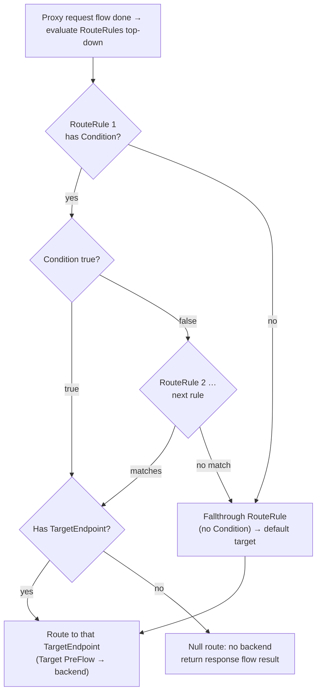

# 2.3 — Conditions, RouteRules & conditional flows

!!! bottomline "Bottom line"
    Apigee branches and routes with **declarative conditions** — boolean expressions over the flow variables from 2.2 — in three places: **conditional Flows** (which flow runs, like dispatching to a controller method), **RouteRules** (which backend a request goes to, first match wins), and the **null route** (route to *no* target to short-circuit a response without ever calling a backend). You express routing as predicates such as `proxy.pathsuffix MatchesPath "/accounts/*"` and `request.verb = "GET"`, not as `if`/`switch` in code. This is the gateway's version of Spring Cloud Gateway predicates and `@RequestMapping` matching.

## Why this exists

In a Spring service, "which code handles this request" is decided by `RequestMappingHandlerMapping` matching the method+path against your `@GetMapping("/accounts")` annotations, and "where does the call go next" is either a downstream `WebClient` you picked with an `if`, or — if you run Spring Cloud Gateway — a set of declarative `predicates` and `filters` in YAML. Two different mechanisms, one implicit (annotation routing) and one explicit (gateway predicates).

Apigee makes **both** explicit and declarative, and unifies them under one expression language. A **condition** is just a boolean over flow variables. The same syntax decides whether a conditional Flow runs *and* whether a RouteRule fires *and* whether a policy Step executes. There's no annotation magic and no place to drop an `if` — you can't write imperative routing logic in a controller because there is no controller. You write the predicate, attach it to the structural element it gates, and Apigee evaluates it at the right moment in the flow.

The payoff is the same reason Spring Cloud Gateway exists: routing decisions become **configuration you can read, diff and change without redeploying business logic**. The cost is that you must think in terms of *where* a condition is evaluated (which of the four attach points, on which structural element) — a condition on a Flow runs during flow selection; a condition on a RouteRule runs at the routing step after the proxy request flow completes.

!!! bridge "Spring Boot bridge"
    RouteRules and conditional Flows are **declarative routing predicates** — map them onto the two Spring mechanisms you already use:

    | Spring | Apigee | Decides |
    |---|---|---|
    | `@GetMapping("/accounts")` matched by `RequestMappingHandlerMapping` | a **conditional `<Flow>`** with `<Condition>` on path + verb | which flow's policies run |
    | Spring Cloud Gateway `predicates: [Path=/accounts/**, Method=GET]` | a **`<RouteRule>`** with `<Condition>` | which TargetEndpoint (backend) is selected |
    | the default/fallback route or `@RequestMapping` with no narrower match | a **RouteRule with no `<Condition>`** (the fallthrough) | what runs when nothing more specific matched |
    | returning `ResponseEntity` from a filter without calling downstream | a **RouteRule with no `<TargetEndpoint>`** (null route) | short-circuit: reply without a backend |

    The intuition "predicates pick the handler, predicates pick the route, there's always a default" transfers cleanly. Apigee's expression language (`MatchesPath`, `=`, `&&`, `||`) is the analogue of the predicate DSL.

!!! breaks "Where the analogy breaks"
    Two differences matter. First, **`@RequestMapping` uses best-match; RouteRules use first-match**. Spring picks the *most specific* mapping regardless of declaration order; an Apigee RouteRule list is evaluated **top to bottom and the first matching rule wins**, so ordering is load-bearing — put specific rules above general ones and the unconditioned fallthrough **last**, or it will swallow everything below it. Second, **conditional-Flow selection is not best-match either, and at most one Flow runs**: Apigee evaluates Flows in order and runs the **first** whose condition is true, then stops — but PreFlow and PostFlow always run around it (from 2.1). So "no Flow matched" is a normal outcome (PreFlow/PostFlow still execute), whereas "no `@RequestMapping` matched" is a 404 in Spring.

## The concept

A **condition** is a boolean expression over flow variables. The common pieces:

- **Operators:** `=` (equals), `!=`, `>` `>=` `<` `<=` (numeric, e.g. on `response.status.code`), `&&`, `||`, `!`.
- **String/path operators:** `MatchesPath` (glob over a path, `*` = one segment, `**` = any), `Matches` / `JavaRegex` (regex), `StartsWith`, `Equals`.
- **Typical predicates:**

```text
proxy.pathsuffix MatchesPath "/accounts"          one exact segment
proxy.pathsuffix MatchesPath "/accounts/*"        /accounts/{id}, one more segment
proxy.pathsuffix MatchesPath "/accounts/**"       /accounts and anything beneath
request.verb = "GET"                              method match
(proxy.pathsuffix MatchesPath "/accounts/*") and (request.verb = "GET")
request.header.x-high-value = "true"              branch on a header
response.status.code >= 500                       branch on the backend's reply (response flow)
```

`proxy.pathsuffix` is the part of the path **after** the proxy's BasePath — if BasePath is `/v1/aisp` and the caller hits `/v1/aisp/accounts/123`, then `proxy.pathsuffix` is `/accounts/123`. That's the variable you almost always match on, because it's BasePath-independent.

A **conditional Flow** wraps a set of Steps in a `<Flow>` with a `<Condition>`; the first Flow whose condition is true runs (in addition to PreFlow/PostFlow):

```xml
<Flows>
  <Flow name="get-accounts">
    <Condition>(proxy.pathsuffix MatchesPath "/accounts") and (request.verb = "GET")</Condition>
    <Request>
      <Step><Name>AM-TagAccountsRead</Name></Step>
    </Request>
  </Flow>
  <Flow name="catch-all"/>   <!-- no Condition: matches anything the above didn't -->
</Flows>
```

A **RouteRule** lives in the ProxyEndpoint and selects a TargetEndpoint after the proxy request flow finishes. Rules are tried **top to bottom; first match wins**; the rule with **no `<Condition>`** is the fallthrough default and must come **last**:

```xml
<!-- specific first -->
<RouteRule name="to-sandbox">
  <Condition>request.header.x-target-env = "sandbox"</Condition>
  <TargetEndpoint>sandbox</TargetEndpoint>
</RouteRule>
<!-- fallthrough default last (no Condition) -->
<RouteRule name="default">
  <TargetEndpoint>production</TargetEndpoint>
</RouteRule>
```

A **null route** is a RouteRule with a `<Condition>` but **no `<TargetEndpoint>`** — it matches, selects no backend, and the proxy returns whatever the response flow produced *without ever calling a target*. Use it to short-circuit (serve a cached/synthetic response, hard-block a method, satisfy a CORS preflight):

```xml
<RouteRule name="noroute-options">
  <Condition>request.verb = "OPTIONS"</Condition>
  <!-- no TargetEndpoint: handled entirely at the edge -->
</RouteRule>
```

Here's how the RouteRule list resolves for a single request — first match wins, with the unconditioned rule as the safety net:



Read it as: rules are tried in order; the **first** whose condition is true is selected; if the selected rule names a target you route to it, and if it names none you short-circuit; if *no* conditioned rule matched, the **unconditioned fallthrough** catches the request. A proxy with no matching RouteRule and no fallthrough returns a runtime routing error — so always keep a default.

## Hands-on lab

You'll add a **conditional Flow** that fires only for `GET /accounts` (attaching a policy that tags the request), plus a **RouteRule** that selects a backend based on a request header — with an unconditioned fallthrough as the default.

<div class="lab" markdown="1">
#### Lab — one conditional Flow, two RouteRules

**Prereqs:** `$ORG`, `$ENV`, `$TOKEN`, `$RUNTIME_HOST` exported, and a proxy named `aisp-accounts` serving under BasePath `/v1/aisp` (reuse the proxy from 1.3/3.2). You need two TargetEndpoints defined — `production` and `sandbox` — even if both point at the same mock for now.

**1. A policy for the matched flow to attach** — it stamps a header proving the conditional Flow ran. Save as `apiproxy/policies/AM-TagAccountsRead.xml`:

```xml
<AssignMessage name="AM-TagAccountsRead">
  <Set>
    <Headers>
      <Header name="x-matched-flow">get-accounts</Header>
    </Headers>
  </Set>
</AssignMessage>
```

**2. A conditional Flow** matching exactly `GET /accounts`, plus a no-Condition catch-all so non-matching paths still have a (no-op) flow. In `proxies/default.xml`, inside `<Flows>`:

```xml
<Flows>
  <Flow name="get-accounts">
    <Condition>(proxy.pathsuffix MatchesPath "/accounts") and (request.verb = "GET")</Condition>
    <Request>
      <Step><Name>AM-TagAccountsRead</Name></Step>
    </Request>
  </Flow>
  <Flow name="catch-all"/>
</Flows>
```

**3. RouteRules** in the same `proxies/default.xml`, *after* `<Flows>` — specific first, unconditioned fallthrough last. A request header chooses the backend; anything else gets `production`:

```xml
<RouteRule name="to-sandbox">
  <Condition>request.header.x-target-env = "sandbox"</Condition>
  <TargetEndpoint>sandbox</TargetEndpoint>
</RouteRule>
<RouteRule name="default">
  <TargetEndpoint>production</TargetEndpoint>
</RouteRule>
```

**4. (Optional) a null route** to hard-block writes at the edge — add it *above* the others so it wins first. It returns without touching any backend; pair it with a RaiseFault in the flow for a clean 405 (RaiseFault comes in a later session):

```xml
<RouteRule name="noroute-writes">
  <Condition>request.verb = "DELETE"</Condition>
</RouteRule>
```

**5. Deploy and exercise each branch:**

```bash
apigeecli apis create bundle --name aisp-accounts --proxy-folder ./aisp-accounts/apiproxy \
  --org "$ORG" --token "$TOKEN"
apigeecli apis deploy --name aisp-accounts --org "$ORG" --env "$ENV" --ovr --wait --token "$TOKEN"

# conditional Flow fires for GET /accounts → x-matched-flow present
curl -s -D - -o /dev/null "https://$RUNTIME_HOST/v1/aisp/accounts" | grep -i x-matched-flow

# RouteRule selects sandbox when the header is set, else production
curl -s -o /dev/null -w "no header → %{http_code}\n" "https://$RUNTIME_HOST/v1/aisp/accounts"
curl -s -o /dev/null -w "sandbox  → %{http_code}\n" -H "x-target-env: sandbox" "https://$RUNTIME_HOST/v1/aisp/accounts"
```

**What success looks like:** `GET /v1/aisp/accounts` returns `x-matched-flow: get-accounts` (the conditional Flow matched), while `GET /v1/aisp/accounts/123` does **not** (it has an extra segment, so the `"/accounts"` predicate is false and only the catch-all ran). Both header variants return a backend status, but the **Trace** shows `to-sandbox` selected when `x-target-env: sandbox` is sent and `default` selected otherwise. If you added the null route, `DELETE` returns without any Target PreFlow appearing in Trace.
</div>

## Verify it

In the Apigee **Trace**, send `GET /v1/aisp/accounts` and confirm the `get-accounts` Flow is highlighted as *matched* while `catch-all` is skipped; then send `GET /v1/aisp/accounts/123` and confirm `get-accounts` is **skipped** (its condition evaluated false) — that proves `MatchesPath "/accounts"` is exact-segment, not a prefix. In the routing step of the Trace, the **selected RouteRule name** is shown; verify it flips between `to-sandbox` and `default` with the header.

A scripted check that the conditional Flow is segment-exact and that the header drives routing:

```bash
hdr() { curl -s -D - -o /dev/null "$@" | awk -F': ' 'tolower($1)=="x-matched-flow"{print $2}' | tr -d '\r'; }

# exact /accounts → matched; /accounts/123 → not matched (empty)
echo "exact:   [$(hdr "https://$RUNTIME_HOST/v1/aisp/accounts")]"
echo "subpath: [$(hdr "https://$RUNTIME_HOST/v1/aisp/accounts/123")]"
```

You should see `exact: [get-accounts]` and `subpath: []` — empty for the sub-path, because `"/accounts"` matches one segment only. (Use `"/accounts/**"` if you wanted both.)

!!! failure "Common failure modes"
    - **Fallthrough RouteRule placed first.** An unconditioned RouteRule at the top wins for *every* request, so no specific rule below it ever fires. Symptom: traffic always hits the default target regardless of headers. Move the no-Condition rule to the **bottom**.
    - **No fallthrough at all.** If every RouteRule has a condition and none match, the request gets a routing failure. Symptom: a runtime error / `500` on paths you didn't anticipate. Always keep one unconditioned default (or a deliberate null route).
    - **`MatchesPath` segment confusion.** `"/accounts/*"` matches `/accounts/123` but **not** `/accounts` itself, and `"/accounts"` does **not** match `/accounts/123`. Use `"/accounts/**"` for "this and everything beneath." Symptom: a flow that fires on the wrong subset of paths.
    - **Matching the full path instead of the suffix.** Conditioning on `request.path` (which includes the BasePath) instead of `proxy.pathsuffix` makes your conditions break the moment BasePath changes. Prefer `proxy.pathsuffix`.
    - **Expecting best-match.** Two RouteRules where a broad one is listed above a narrow one: the broad one wins because it's first. Order specific → general, not by how "specific" they look.

!!! stretch "Stretch goal"
    Take one mapping out of your service's `RequestMappingHandlerMapping` — say a `@GetMapping("/accounts/{accountId}/transactions")` with a `params`/`headers` condition or a `@RequestMapping` `produces` clause — and express it as a single Apigee conditional Flow `<Condition>`. Decide how the `{accountId}` path variable, the method, and any header/param predicate each become a clause (`proxy.pathsuffix MatchesPath "/accounts/*/transactions"`, `request.verb = "GET"`, `request.header.accept Matches "application/json"`). Note the one piece that *doesn't* translate — Spring's best-match precedence has no direct equivalent, so you must encode that ordering yourself in Flow/RouteRule order.

## Recap & next

You can now branch and route declaratively: **conditions** are booleans over flow variables; **conditional Flows** pick which flow's policies run (first true wins, alongside PreFlow/PostFlow); **RouteRules** pick the backend (top-down, first match wins, unconditioned rule is the fallthrough that must come last); and a **null route** short-circuits with no backend at all. You replaced controller `if`/`switch` logic with predicates attached to structural elements — and you know `proxy.pathsuffix` + `MatchesPath` are the workhorses, with segment semantics that bite if you forget them.

**Next — 2.4:** the two policies you've been leaning on get their full treatment — **AssignMessage** (build and reshape whole messages: headers, body, variables) and **ExtractVariables** (pull typed values *out* of a path, query, header, or JSON/XML body into the flow-variable bag you mastered in 2.2).
