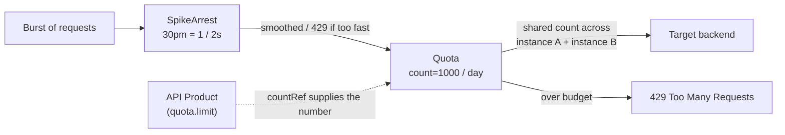

# 2.6 — Quotas & SpikeArrest: distributed and product-scoped

!!! bottomline "Bottom line"
    Apigee gives you two protections that Spring developers tend to conflate. **SpikeArrest** smooths bursts — it enforces a *per-message arrival rate* (e.g. 30 per minute, applied as one-every-2s), not a real counter. **Quota** is a genuine **distributed counter** over an interval, shared across every runtime instance, and ideally **scoped to the API product** so the limit lives in config rather than in your proxy. Get the distinction wrong and you'll either reject legitimate traffic or never enforce the plan you sold.

## Why this exists

In a Spring service you reach for Bucket4j or Resilience4j, and the limiter lives **inside the JVM**. Each pod owns its own bucket. Scale to four pods and your "100 requests per minute" quietly becomes 400 — the counter is per-instance and there is no shared truth. You paper over it with a Redis-backed bucket, which means you now operate Redis, a Lua script, and a clock-skew problem you didn't ask for.

Apigee inverts this. Rate limiting is a **platform concern enforced at the edge**, before the request ever reaches a pod, and the counter is **distributed by default** — every runtime instance reads and writes the same logical count, so "1000 per day" means 1000 across the whole fleet, not 1000 per replica. That removes the entire class of "my limiter doesn't agree with itself" bugs, and it lets the *number* live where it belongs: on the **API product** (the unit of access from 3.2), not hard-coded in a proxy you'd have to redeploy to change.

There are really three tools here, and the session's job is to keep them straight. **SpikeArrest** protects the backend from sudden bursts (a thundering herd, a retry storm). **Quota** enforces a business entitlement over time (the plan a developer bought). **Concurrent rate limit** caps simultaneous in-flight calls to a target — a niche third tool we name but won't belabour. Reaching for the wrong one is the most common mistake in this part of the course.

!!! bridge "Spring Boot bridge"
    You already own both ideas; Apigee just splits them cleanly and makes them distributed.

    | Spring tool | Apigee equivalent | Key difference |
    |---|---|---|
    | Resilience4j `RateLimiter` (`limitForPeriod`, `limitRefreshPeriod`) | **Quota** | Quota is a *distributed* counter across all instances; Resilience4j counts per-JVM. |
    | Bucket4j burst smoothing / token refill | **SpikeArrest** | SpikeArrest enforces an *arrival rate* (one-every-Nms), not a refillable token bucket. |
    | Redis-backed bucket you operate yourself | **Quota's built-in distributed store** | No Redis to run; the runtime shares the count for you. |
    | `@RateLimiter(name = "plan")` wired to a tier | **Quota with `countRef` from the product** | The limit is a product field, changed without a redeploy. |

!!! breaks "Where the analogy breaks"
    SpikeArrest is **not** a counter, and treating it like one is the trap. Resilience4j's "10 per second" lets all 10 arrive in the first millisecond and then blocks the rest. SpikeArrest's `30pm` means *at most one request every two seconds* — it smooths arrivals, so even nine requests spread evenly across a minute can trip it if two land too close together. There is no "remaining budget" to read. Quota is the one with a budget. The second break: a Resilience4j limiter resets on pod restart because its state is in-process; Apigee's distributed Quota survives instance churn because the count lives outside any one instance. Stop reasoning about "my replica's counter" — there isn't one.

## The concept

Three policies, three jobs. Read this as "what each one actually counts":

```text
SpikeArrest   → an ARRIVAL RATE. <Rate>30pm</Rate> ≈ 1 request / 2s.
                Smooths bursts. No interval budget, no "remaining". Per-message.
Quota         → a DISTRIBUTED COUNTER over an interval. <Allow count="1000"/>
                <Interval>1</Interval> <TimeUnit>day</TimeUnit>. Shared across all
                instances. Scope it per-app/product with an <Identifier> + countRef.
Concurrent    → in-flight calls to a target at once (ConcurrentRateLimit). Niche;
                use when the backend caps simultaneous connections.
```

The interactive simulator below makes the SpikeArrest *smoothing* behaviour tangible — note how it rejects a second request that arrives too soon after the first, even though you're nowhere near any "per minute" total:

```widget
{"type":"ratelimit","title":"SpikeArrest simulator","ratePerMin":30}
```

Quota is the opposite shape. It doesn't care about spacing — it cares about the **total** within a window. The crucial property is *distributed*: instance A and instance B increment the same logical counter, so the developer's 1000/day can't be multiplied by your replica count. And the limit itself should come from the **product**, via `countRef`, so changing a customer's plan is a product edit, not a proxy redeploy — exactly the indirection established in 3.2.



## Hands-on lab

<div class="lab" markdown="1">
#### Lab — smooth bursts with SpikeArrest, then count with a product-driven Quota

**Prereqs:** `$ORG`, `$ENV`, `$TOKEN`, `$RUNTIME_HOST` exported, and a deployed proxy that verifies an API key (reuse `aisp-accounts` with its `VK-Key` policy and product `aisp-read` from 3.2). The Quota here reads its limit from that product.

**1. A SpikeArrest** to smooth bursts. `30pm` means the runtime accepts at most one request every two seconds; anything faster is rejected. Put this in `apiproxy/policies/SA-Smooth.xml`:

```xml
<SpikeArrest name="SA-Smooth">
  <Rate>30pm</Rate>
  <UseEffectiveCount>true</UseEffectiveCount>
</SpikeArrest>
```

`UseEffectiveCount` divides the rate fairly across runtime instances so the *aggregate* edge rate matches what you configured.

**2. A product-driven Quota** — the distributed counter. Drive `count`, `interval`, and `timeUnit` from the product fields that `VK-Key` populated (see 3.2), and identify the count per app so each consumer gets its own budget. Put this in `apiproxy/policies/Q-PerApp.xml`:

```xml
<Quota name="Q-PerApp" type="calendar">
  <Allow countRef="verifyapikey.VK-Key.apiproduct.developer.quota.limit" count="1000"/>
  <Interval ref="verifyapikey.VK-Key.apiproduct.developer.quota.interval">1</Interval>
  <TimeUnit ref="verifyapikey.VK-Key.apiproduct.developer.quota.timeunit">day</TimeUnit>
  <Identifier ref="verifyapikey.VK-Key.client_id"/>
  <Distributed>true</Distributed>
  <Synchronous>true</Synchronous>
</Quota>
```

`<Distributed>true</Distributed>` is what makes the count shared across instances; `<Synchronous>true</Synchronous>` makes every instance read the live count before allowing (slightly slower, strictly correct — the right default for FAPI plans).

**3. Attach both in the ProxyEndpoint request PreFlow** — ordering matters: verify identity, smooth the burst, then count against the budget. In `proxies/default.xml`:

```xml
<PreFlow name="PreFlow">
  <Request>
    <Step><Name>VK-Key</Name></Step>
    <Step><Name>SA-Smooth</Name></Step>
    <Step><Name>Q-PerApp</Name></Step>
  </Request>
</PreFlow>
```

SpikeArrest sits *before* Quota so a burst is rejected cheaply (429) without ever consuming a quota unit.

**4. Deploy the new revision:**

```bash
apigeecli apis create bundle --name aisp-accounts --proxy-folder ./aisp-accounts/apiproxy --org "$ORG" --token "$TOKEN"
apigeecli apis deploy --name aisp-accounts --org "$ORG" --env "$ENV" --ovr --wait --token "$TOKEN"
```

**5. Trip SpikeArrest with a tight burst** — fire ten requests back-to-back and watch most come back `429`:

```bash
KEY="<paste consumerKey from 3.2>"
for i in $(seq 1 10); do
  curl -s -o /dev/null -w "%{http_code} " -H "x-api-key: $KEY" \
    "https://$RUNTIME_HOST/aisp-accounts/accounts"
done; echo
# → something like: 200 429 429 429 429 429 429 429 429 429
```

**6. Confirm the Quota is product-scoped and distributed** — read the rate-limit headers Apigee returns for an allowed call (and check the same variables in Trace):

```bash
curl -s -D - -o /dev/null -H "x-api-key: $KEY" \
  "https://$RUNTIME_HOST/aisp-accounts/accounts" | grep -i ratelimit
```

**What success looks like:** the burst in step 5 returns one (or few) `200` followed by a run of `429`s — proof SpikeArrest is *smoothing arrivals*, not counting a total. Trace shows `Q-PerApp` reporting a limit of `1000` sourced from `apiproduct.developer.quota.limit` (not a hard-coded number), and `ratelimit.Q-PerApp.used.count` increments by one per allowed call regardless of which instance served it. Then raise the plan by editing the **product's** quota — the proxy honours the new ceiling with no redeploy.
</div>

## Verify it

Two things to confirm, because they're the two distinct behaviours. First, SpikeArrest is a *rate*, not a budget: space your requests two seconds apart with `sleep 2` between curls and they all return `200`, even though you've now sent far more than 30 — proving it smooths arrivals rather than counting them. Second, Quota is *distributed*: the response header `X-RateLimit-Remaining` (or the Trace variable `ratelimit.Q-PerApp.available.count`) decrements consistently no matter how many instances sit behind the env-group host, which a per-pod Bucket4j could never guarantee.

```bash
# spaced calls never trip SpikeArrest — it's an arrival rate, not a total
for i in 1 2 3; do
  curl -s -o /dev/null -w "%{http_code}\n" -H "x-api-key: $KEY" \
    "https://$RUNTIME_HOST/aisp-accounts/accounts"
  sleep 2
done
```

!!! failure "Common failure modes"
    - **Using SpikeArrest to enforce a plan.** It has no interval budget, so "1000 per day" cannot be a SpikeArrest. Symptom: a customer who paces requests evenly never hits their limit, while a legitimate burst gets 429'd. Use Quota for the budget, SpikeArrest only for smoothing.
    - **Forgetting `<Distributed>true</Distributed>` on Quota.** The default is per-instance counting. Symptom: your "1000/day" allows roughly 1000 × (instance count) before rejecting, and the number drifts as instances scale.
    - **Hard-coding the Quota `count` in the proxy.** Then every plan change is a redeploy. Symptom: marketing changes a tier and nothing happens until you ship. Drive it from `countRef` off the product (3.2).
    - **Putting Quota before SpikeArrest.** A burst then consumes quota units before being rejected, double-charging the budget for traffic you never served. Order is verify → smooth → count.
    - **Synchronous Quota on a latency-critical path.** `<Synchronous>true</Synchronous>` adds a round trip to the shared store. Symptom: p99 climbs. Asynchronous Quota trades exactness for speed — but for FAPI plan enforcement, keep it synchronous.

!!! stretch "Stretch goal"
    Take a real Resilience4j `RateLimiter` config from one of your services — its `limitForPeriod`, `limitRefreshPeriod`, and `timeoutDuration` — and write the equivalent Apigee setup. You'll find `limitForPeriod` plus `limitRefreshPeriod` map to a **Quota** (`count` plus `interval`/`timeUnit`), but there's no clean Apigee home for `timeoutDuration` (how long a caller *waits* for a permit) because Apigee rejects rather than queues. Then add a **SpikeArrest** to cover the burst-smoothing that Resilience4j's `RateLimiter` doesn't do at all, and note the one semantic you can't reproduce: Resilience4j's per-JVM reset on restart simply doesn't exist once the counter is distributed.

## Recap & next

You can now tell the two protections apart and reach for the right one: **SpikeArrest** smooths *arrival rate* (per-message, no budget, 1-every-Nms), **Quota** is a *distributed counter* over an interval that should be **product-scoped** via `countRef` so plan changes never touch the proxy, and **Concurrent rate limit** caps simultaneous in-flight calls. The headline difference from your Spring instinct: these counters are shared across the whole runtime, so "1000 per day" finally means 1000 — not 1000 per pod.

**Next — 2.7:** where state actually lives. You'll learn to pick between **ResponseCache**, **Key-Value Maps**, and **PropertySets** — caching, mutable config, and read-only properties — and resist the Spring reflex to "just add a database" for things the gateway already stores for you.
