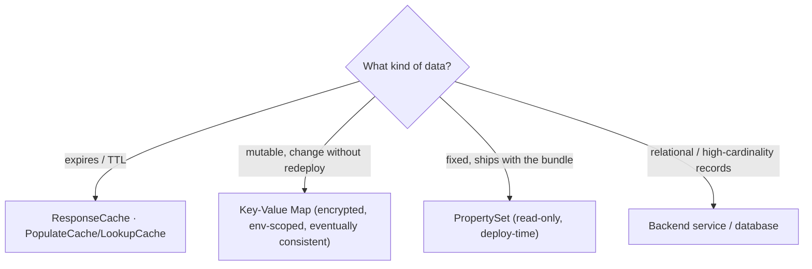

# 2.7 — Caching vs KVM vs PropertySets: the three stores

!!! bottomline "Bottom line"
    Apigee gives you three small, purpose-built stores, and the skill is matching data to the right one. **ResponseCache** (and the lower-level **LookupCache** / **PopulateCache**) holds *transient cached values*. **Key-Value Maps (KVM)** hold *mutable, encrypted, environment-scoped* config and tokens — but a KVM is **not a database**. **PropertySets** hold *read-only* properties packaged with the bundle at deploy time. Reach for these before you reach for "just add a database," because three of the four reasons you'd want one are already solved.

## Why this exists

A Spring developer under pressure has a reflex: any time state needs to outlive a single request, add a row, add a table, add a datasource. That instinct is wrong at the gateway tier most of the time, because the things a *proxy* needs to remember are narrow and short-lived — a cached backend response, a rotating OAuth token, a feature flag, a per-environment base URL — and a relational database is heavy, slow, and one more thing to operate on the hot path.

Apigee already ships the three stores those needs map to, and they differ along exactly the axes you care about: **lifetime** (does it expire?), **mutability** (can a running proxy write it?), and **scope** (environment-wide, or baked into the bundle?). Choosing correctly is a design decision with real consequences — put a secret in a PropertySet and you've committed it to the bundle; treat a KVM like Postgres and you'll be surprised by eventual consistency.

The fourth need — actual relational or document data, things like *account balances* and *transactions* — genuinely is a backend's job, and Apigee is right to route to it rather than store it. The point of this session is to stop you using a database for the *first three* needs, where a native store is faster, cheaper, and already encrypted.

!!! bridge "Spring Boot bridge"
    Each store maps to something you already use in Spring — and none of them maps to a database.

    | Spring concept | Apigee store | Lifetime | Mutable at runtime? |
    |---|---|---|---|
    | `@Cacheable` / Spring Cache (Caffeine, Redis) | **ResponseCache** / **PopulateCache** + **LookupCache** | TTL-bound, expires | Written by the cache policy |
    | `@ConfigurationProperties` you can change without redeploy (e.g. Spring Cloud Config) | **Key-Value Map (KVM)** | Persistent until overwritten | **Yes** — encrypted, env-scoped |
    | `application.yml` / a read-only `@PropertySource` baked into the jar | **PropertySet** | Lifetime of the deployed revision | **No** — deploy-time only |
    | A JPA entity / relational table | *(none — call the backend)* | — | — |

!!! breaks "Where the analogy breaks"
    The one that bites is **"KVM is not a database."** It looks like a key/value table you can read and write, so people treat it like one — bulk-loading thousands of rows, expecting read-your-writes, querying it on every request. It is **eventually consistent**: a write may take seconds to propagate to every runtime instance, there are no transactions, no queries beyond key lookup, and it's tuned for *config-shaped* data (dozens to hundreds of small entries), not high-cardinality records. The other break: a `@PropertySource` in Spring can be re-read or overridden at runtime via the environment; an Apigee **PropertySet** is genuinely immutable for the life of the deployed revision — to change a value you redeploy the bundle. Read-only means read-only.

## The concept

Match the data to the store along three axes — lifetime, mutability, scope:

```text
ResponseCache      cache a whole backend RESPONSE keyed by request. TTL. Skips the
                   backend entirely on a hit. ↔ @Cacheable on a controller method.
LookupCache /      cache ARBITRARY values (a computed token, a JWKS doc). PopulateCache
PopulateCache      writes with a TTL; LookupCache reads. ↔ manual CacheManager.put/get.
KVM                MUTABLE, ENCRYPTED, environment-scoped key/value. Eventually
                   consistent. Good for rotating tokens + config. NOT a database.
                   ↔ @ConfigurationProperties you can edit without a redeploy.
PropertySet        READ-ONLY properties packaged in the bundle at deploy time. Read as
                   propertyset.<name>.<key>. ↔ a baked-in application.yml.
```

Decision rule: **Does it expire?** → cache. **Must a running proxy change it (a rotating token, a flag you flip without shipping)?** → KVM. **Is it fixed config that travels with the code (a backend base URL per environment, a feature constant)?** → PropertySet. **Is it real relational/document data (balances, transactions)?** → none of these; call the backend.



Now check your instinct — pick the right store for each case:

```widget
{
  "type": "quiz",
  "title": "Which store?",
  "questions": [
    {
      "q": "A rotating client-credentials token for a downstream backend, valid ~1 hour, must be reused across requests and refreshed when it expires. Where does it live?",
      "options": ["PropertySet", "ResponseCache", "A KVM (or PopulateCache with a TTL)", "A new Postgres table"],
      "answer": 2,
      "explain": "It's mutable and reused: a KVM (it survives, can be overwritten on refresh) or PopulateCache with a TTL matching the token lifetime. Not a PropertySet — that's read-only and deploy-time."
    },
    {
      "q": "The per-environment base URL of the accounts backend (different in eval vs prod), fixed for the life of the deployment. Where does it belong?",
      "options": ["A PropertySet, read as propertyset.<name>.<key>", "A KVM written at runtime", "ResponseCache", "Hard-coded in the TargetEndpoint XML"],
      "answer": 0,
      "explain": "Fixed config that ships with the bundle and never changes at runtime is a PropertySet. (TargetServers also work, but the question is about the three stores.)"
    },
    {
      "q": "A full GET /accounts response you want to serve without hitting the backend for 60 seconds. Which store?",
      "options": ["KVM", "PropertySet", "ResponseCache", "A database"],
      "answer": 2,
      "explain": "Caching a whole backend response keyed by the request, with a TTL, is exactly ResponseCache — the @Cacheable of the gateway."
    },
    {
      "q": "Why is 'just put it in a KVM' wrong for 50,000 customer records queried per request?",
      "options": ["KVMs are read-only", "A KVM is not a database — eventually consistent, key-lookup only, tuned for config-sized data", "KVMs can't be encrypted", "KVMs expire after 60s"],
      "answer": 1,
      "explain": "KVM is config-shaped storage: eventually consistent, no queries beyond key lookup, no transactions. High-cardinality record data belongs behind a backend."
    }
  ]
}
```

## Hands-on lab

<div class="lab" markdown="1">
#### Lab — use all three stores in one proxy

**Prereqs:** `$ORG`, `$ENV`, `$TOKEN`, `$RUNTIME_HOST` exported, and the deployed `aisp-accounts` proxy from earlier sessions.

**1. Create an encrypted KVM and seed a value** — environment-scoped, encrypted at rest. We'll store a downstream backend token (the kind of mutable, rotatable value a KVM is *for*):

```bash
apigeecli kvms create --name backend-secrets --env "$ENV" --org "$ORG" --token "$TOKEN"
apigeecli kvms entries create --map backend-secrets --key downstream-token \
  --value "seed-token-rotate-me" --env "$ENV" --org "$ORG" --token "$TOKEN"
```

**2. Read the KVM from a policy** with KeyValueMapOperations. `mapIdentifier` names the map; `Get` pulls the entry into a variable. Put this in `apiproxy/policies/KVM-Get-Token.xml`:

```xml
<KeyValueMapOperations name="KVM-Get-Token" mapIdentifier="backend-secrets">
  <Scope>environment</Scope>
  <ExpiryTimeInSecs>300</ExpiryTimeInSecs>
  <Get assignTo="private.downstream.token">
    <Key><Parameter>downstream-token</Parameter></Key>
  </Get>
</KeyValueMapOperations>
```

`ExpiryTimeInSecs` caches the read in-memory so you're not hitting the KVM store every request — the `private.` prefix keeps the value out of Trace.

**3. Add a PropertySet for read-only, deploy-time config.** Drop a properties file into the bundle at `apiproxy/resources/properties/backend.properties`:

```text
base.url=https://mocktarget.apigee.net
accounts.path=/json
feature.masking.enabled=true
```

Reference it anywhere a variable is allowed as `propertyset.backend.base.url`, `propertyset.backend.accounts.path`, etc. No policy is needed to "load" it — it's resolved at deploy time and read inline.

**4. Cache the GET with ResponseCache** so repeat reads skip the backend. Put this in `apiproxy/policies/RC-Accounts.xml`:

```xml
<ResponseCache name="RC-Accounts">
  <CacheKey>
    <KeyFragment ref="request.uri" type="string"/>
  </CacheKey>
  <ExpirySettings>
    <TimeoutInSeconds>60</TimeoutInSeconds>
  </ExpirySettings>
  <Scope>Exclusive</Scope>
</ResponseCache>
```

Attach `RC-Accounts` in the ProxyEndpoint: a ResponseCache policy is referenced *once* but acts on both the request (lookup) and response (populate) flows automatically. Attach `KVM-Get-Token` in the request PreFlow so the token is available before the backend call. In `proxies/default.xml`:

```xml
<PreFlow name="PreFlow">
  <Request>
    <Step><Name>RC-Accounts</Name></Step>
    <Step><Name>KVM-Get-Token</Name></Step>
  </Request>
  <Response>
    <Step><Name>RC-Accounts</Name></Step>
  </Response>
</PreFlow>
```

**5. Deploy:**

```bash
apigeecli apis create bundle --name aisp-accounts --proxy-folder ./aisp-accounts/apiproxy --org "$ORG" --token "$TOKEN"
apigeecli apis deploy --name aisp-accounts --org "$ORG" --env "$ENV" --ovr --wait --token "$TOKEN"
```

**6. Prove the cache works** — first call hits the backend, the second is served from cache (notably faster, identical body):

```bash
KEY="<paste consumerKey>"
for i in 1 2; do
  curl -s -o /dev/null -w "call $i: status=%{http_code} time=%{time_total}s\n" \
    -H "x-api-key: $KEY" "https://$RUNTIME_HOST/aisp-accounts/accounts"
done
```

**What success looks like:** call 2's `time_total` is dramatically lower than call 1's (cache hit). In Trace you see `KVM-Get-Token` populate `private.downstream.token` from the encrypted map, `propertyset.backend.base.url` resolve to the value from your properties file with no policy, and `RC-Accounts` report a *CacheHit* on the second request. Three stores, three jobs, zero databases.
</div>

## Verify it

Confirm each store behaves to its own contract. For the **KVM**, rotate the value at runtime and watch the proxy pick it up *without a redeploy* — `apigeecli kvms entries update --map backend-secrets --key downstream-token --value "rotated-2026" ...` then re-trace; the new value appears (allow a few seconds for propagation — that's the eventual consistency the analogy warns about). For the **PropertySet**, try to "change" `base.url` the same way and you'll find there's no runtime write at all — it only changes when you redeploy the bundle. For **ResponseCache**, watch the `time_total` collapse on the second call and confirm Trace shows `responsecache.RC-Accounts.cachehit = true`.

```bash
# KVM is mutable at runtime; PropertySet is not
apigeecli kvms entries update --map backend-secrets --key downstream-token \
  --value "rotated-2026" --env "$ENV" --org "$ORG" --token "$TOKEN"
# re-call and check Trace: private.downstream.token now reads "rotated-2026"
```

!!! failure "Common failure modes"
    - **Treating a KVM like a database.** Bulk-loading thousands of records and expecting queries or read-your-writes. Symptom: stale reads right after a write, or slow lookups at scale. KVM is config-sized, eventually consistent, key-lookup only.
    - **Putting secrets in a PropertySet.** It's read-only *and* committed to the bundle, so the secret lands in source control and is visible to anyone with the bundle. Symptom: a token in git history. Secrets belong in an encrypted KVM (or a secrets manager via 3.x).
    - **Expecting to change a PropertySet at runtime.** There's no write API — it's deploy-time only. Symptom: you "update" a value and nothing changes until you redeploy. If it must change without shipping, it's a KVM.
    - **ResponseCache with a key too broad or too narrow.** Too broad (omitting a query param) serves one user's data to another; too narrow (including a volatile header) never hits. Symptom: wrong cached body, or a cache that never warms.
    - **Caching authenticated, per-user responses globally.** A shared cache key leaks data across consumers. Symptom: customer A sees customer B's accounts. Include the identity in the `CacheKey` or don't cache it.

!!! stretch "Stretch goal"
    Take one hard-coded value from a real `application.yml` — a downstream base URL or a feature flag — and move it into a **PropertySet** in a proxy, reading it as `propertyset.<name>.<key>` from a policy or condition. Then decide, honestly, whether it *should* have been a PropertySet at all: if you'd ever want to flip it without a redeploy, it belonged in a **KVM** instead. Writing down *why* you chose one over the other — "this never changes between deploys" vs "ops needs to toggle this live" — is the actual skill this session is teaching.

## Recap & next

You can now place data in the right store instead of reflexively adding a database: **ResponseCache** (plus **LookupCache**/**PopulateCache**) for TTL-bound cached values, a **KVM** for mutable, encrypted, environment-scoped config and tokens — remembering it's *eventually consistent and not a database* — and a **PropertySet** for read-only config that ships with the bundle and is read as `propertyset.<name>.<key>`. Real relational records still belong behind a backend; everything else has a native home at the edge.

**Next — 3.1:** with state sorted, you turn to the message itself — **threat protection, CORS, and data masking**. You'll defend against payload-borne attacks (JSON/XML bombs, injection), get cross-origin requests right at the edge, and scrub sensitive fields out of logs and traces before they ever leak.
