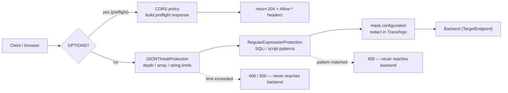

# 3.1 — Threat protection, CORS & data masking

!!! bottomline "Bottom line"
    Three edge concerns you scatter across a Spring app — payload hardening, CORS, and log scrubbing — collapse into three declarative Apigee policies you attach at the **ProxyEndpoint request** flow (point ① from 2.1). **JSONThreatProtection / XMLThreatProtection** reject hostile structure before parsing, **RegularExpressionProtection** screens for injection patterns, a **CORS** policy answers the browser preflight, and a **mask configuration** keeps secrets out of Trace and logs. By the end you can reject a depth-bomb, answer an `OPTIONS` preflight, and prove an `Authorization` header is redacted in a debug session.

## Why this exists

In a Spring service these four jobs live in four different places: a max-payload / Jackson depth setting (or a custom filter) for malformed bodies, a regex or WAF in front for injection strings, `@CrossOrigin` or a `CorsConfigurationSource` bean for browsers, and a Logback converter or `@JsonIgnore` for log scrubbing. Each is configured in its own idiom, owned by a different part of the codebase, and easy to forget on a new endpoint. Nothing forces them to be consistent across services.

Apigee pulls all four to the **edge**, declaratively, so they apply uniformly to every proxy that attaches them — and crucially, they run *before* your backend (and often before Apigee even parses the body). A 50-level-deep JSON object meant to exhaust your parser is rejected by **JSONThreatProtection** at point ① and the backend is never touched. That's the same instinct as putting a WAF in front of your fleet, except the rules are versioned config that ships with the proxy.

The data-masking piece is the one Spring developers underrate. Apigee's **Trace / debug** captures full request and response messages for inspection — which means an `Authorization: Bearer …` header or a PAN in the body would sit in plaintext in the debug session and the analytics store unless you mask it. A **mask configuration** is the gateway equivalent of telling Logback "never print this field," but it covers the *whole captured message*, not just your log lines.

!!! bridge "Spring Boot bridge"
    Each concern maps to something you already do by hand — Apigee just makes it one attached policy instead of four scattered mechanisms:

    | Spring mechanism | Apigee policy | What it guards |
    |---|---|---|
    | `spring.servlet.multipart.max-*`, Jackson depth limits, a custom size filter | **JSONThreatProtection** / **XMLThreatProtection** | Structural attacks: depth bombs, huge arrays, billion-laughs |
    | A regex pre-check or upstream WAF rule | **RegularExpressionProtection** | Injection patterns: SQLi, `<script>`, path traversal |
    | `@CrossOrigin` / `CorsConfigurationSource` bean | **CORS** policy | Browser preflight + actual-request headers |
    | Logback masking converter, `@JsonIgnore`, MDC scrubbing | **mask configuration** (`MaskDataConfiguration`) | Secrets in Trace, debug sessions, and analytics |

    If you've ever wished `@CrossOrigin` *also* enforced a payload-depth limit and *also* kept the auth header out of your logs, that bundle is the inbound policy set on an Apigee proxy.

!!! breaks "Where the analogy breaks"
    Spring's CORS handling is **automatic** for the actual request — the framework adds `Access-Control-Allow-Origin` to your real `GET`/`POST` responses and short-circuits the `OPTIONS` preflight for you. Apigee's **CORS** policy only builds the preflight response and sets the headers; you must attach it deliberately and, for the preflight, ensure the bare `OPTIONS` request is answered *without* routing to the backend — there's no controller behind it. And masking is broader than log scrubbing: it governs what the **platform's own Trace tooling** can show an operator, not just what your application writes to a file. Forgetting it leaks the secret to anyone with Trace access even if your own log lines are clean.

## The concept

Inbound protection is **layered and ordered**: each policy is a gate that can reject the request before the next one — and the backend — ever sees it. You attach them in the ProxyEndpoint request PreFlow so they run for every path.



Read it as: a browser preflight (`OPTIONS`) is answered by the **CORS** policy and returns immediately; a real request runs the gauntlet of structural and pattern checks, and only a request that survives all of them reaches the backend. Masking isn't a gate — it's a cross-cutting setting that changes what every other stage is *allowed to expose*.

A few specifics that bite:

- **JSONThreatProtection** limits are about *shape*, not size alone: `<ContainerDepth>`, `<ObjectEntryCount>`, `<ArrayElementCount>`, and `<StringValueLength>`. A 10 MB flat array and a 200-level-deep object are different attacks; set both.
- **RegularExpressionProtection** matches named sources (`request.header`, `request.queryparam`, `request.content`) against patterns. It's a coarse net — defence in depth, not a substitute for parameterised backend queries.
- A **mask configuration** lives in the proxy as `policies/` data or a `resources/` mask file referencing variables and JSONPath/XPath; it redacts in Trace and the debug UI. Sensitive headers (`Authorization`) and body fields (a PAN) should both be listed.

!!! pitfall "Watch out"
    Masking only hides values in **Trace, the debug UI, and analytics** — it does *not* strip the field from the response, nor stop it reaching the backend. If a PAN must not leave the building, that's an `AssignMessage`/transform job, not a mask. Treat masking purely as "what an operator with Trace access can read," never as data removal.

## Hands-on lab

<div class="lab" markdown="1">
#### Lab — harden an inbound proxy: threat limits, CORS preflight, and a Trace mask

**Prereqs:** `$ORG`, `$ENV`, `$TOKEN`, `$RUNTIME_HOST` exported, and a deployed proxy named `aisp-accounts` (the one from 3.2, or any proxy serving `/accounts`).

**1. JSONThreatProtection** — reject hostile structure before parsing. Put this in `apiproxy/policies/`:

```xml
<!-- JTP-Limits.xml -->
<JSONThreatProtection name="JTP-Limits">
  <Source>request</Source>
  <ContainerDepth>10</ContainerDepth>
  <ObjectEntryCount>50</ObjectEntryCount>
  <ArrayElementCount>100</ArrayElementCount>
  <StringValueLength>4096</StringValueLength>
</JSONThreatProtection>
```

**2. RegularExpressionProtection** — screen query params and body for obvious injection. This is a coarse net layered on top of a properly parameterised backend, not a replacement for it:

```xml
<!-- REP-Injection.xml -->
<RegularExpressionProtection name="REP-Injection">
  <Source>request</Source>
  <QueryParam name="q">
    <Pattern>[\s]*(?i)(delete|drop|update|insert)[\s]</Pattern>
    <Pattern>(?i)(--|;|/\*|\*/|xp_)</Pattern>
  </QueryParam>
  <JSONPayload escapeSlashCharacter="true">
    <Pattern>(?i)<\s*script</Pattern>
  </JSONPayload>
</RegularExpressionProtection>
```

!!! pitfall "Watch out"
    Set these limits against your *real* payloads, not guessed defaults. A genuine Open Banking consent body can be deeper or have more entries than you expect, and a too-tight `ContainerDepth`/`ObjectEntryCount` rejects legitimate large or deeply nested requests with a confusing `4xx`/`5xx`. Tighten from observed traffic, not from a round number.

**3. CORS** — answer the browser preflight safely. Pin a real origin in production; the `*` shown here is for the lab only and must not be combined with credentials:

```xml
<!-- CORS-AISP.xml -->
<CORS name="CORS-AISP">
  <AllowOrigins>https://app.acme-budgeting.example</AllowOrigins>
  <AllowMethods>GET, POST, OPTIONS</AllowMethods>
  <AllowHeaders>Authorization, Content-Type, x-fapi-interaction-id</AllowHeaders>
  <ExposeHeaders>x-fapi-interaction-id</ExposeHeaders>
  <MaxAge>3600</MaxAge>
  <AllowCredentials>false</AllowCredentials>
  <GeneratePreflightResponse>true</GeneratePreflightResponse>
  <IgnoreUnresolvedVariables>true</IgnoreUnresolvedVariables>
</CORS>
```

**4. Attach them** in the ProxyEndpoint request PreFlow (point ①). Order matters — CORS first so a preflight short-circuits, then the threat checks for real requests:

```xml
<PreFlow name="PreFlow">
  <Request>
    <Step>
      <Name>CORS-AISP</Name>
      <Condition>request.verb == "OPTIONS"</Condition>
    </Step>
    <Step><Name>JTP-Limits</Name></Step>
    <Step><Name>REP-Injection</Name></Step>
  </Request>
  <Response/>
</PreFlow>
```

!!! pitfall "Watch out"
    A CORS preflight is an **unauthenticated `OPTIONS`** request — the browser sends no API key or token on it. So never put `VerifyAPIKey`/`VerifyAccessToken` ahead of the CORS step, or the preflight `401`s and the real request never fires. Gate auth on the real verb, and let `OPTIONS` short-circuit to the CORS policy. (Likewise, `Access-Control-Allow-Origin: *` together with credentials is invalid — browsers reject it outright.)

**5. Mask secrets in Trace.** Add a mask configuration so the `Authorization` header and a PAN field never appear in a debug session. Create `apiproxy/resources/mask/aisp-mask.xml` (or attach via the proxy's `MaskDataConfiguration`):

```xml
<MaskDataConfiguration name="aisp-mask">
  <Namespaces/>
  <JSONPaths>
    <Request><JSONPath>$.accountIdentification.pan</JSONPath></Request>
    <Response><JSONPath>$.data[*].pan</JSONPath></Response>
  </JSONPaths>
  <Variables>
    <Variable>request.header.Authorization</Variable>
    <Variable>request.header.x-api-key</Variable>
  </Variables>
</MaskDataConfiguration>
```

**6. Redeploy and exercise each gate:**

```bash
apigeecli apis create bundle --name aisp-accounts --proxy-folder ./aisp-accounts/apiproxy --org "$ORG" --token "$TOKEN"
apigeecli apis deploy --name aisp-accounts --org "$ORG" --env "$ENV" --ovr --wait --token "$TOKEN"

# CORS preflight → 204 with Allow-* headers, no backend hit
curl -s -o /dev/null -w "preflight: %{http_code}\n" -X OPTIONS \
  -H "Origin: https://app.acme-budgeting.example" \
  -H "Access-Control-Request-Method: GET" \
  "https://$RUNTIME_HOST/aisp-accounts/accounts"

# Depth bomb → rejected before the backend
printf '%s' "$(python3 -c 'print("{\"a\":"*40 + "1" + "}"*40)')" > /tmp/deep.json
curl -s -o /dev/null -w "depth bomb: %{http_code}\n" -X POST \
  -H "Content-Type: application/json" --data @/tmp/deep.json \
  "https://$RUNTIME_HOST/aisp-accounts/accounts"

# Clean request → 200
curl -s -o /dev/null -w "clean:     %{http_code}\n" \
  -H "Authorization: Bearer dummy" -H "x-fapi-interaction-id: $(uuidgen)" \
  "https://$RUNTIME_HOST/aisp-accounts/accounts"
```

**What success looks like:** `preflight: 204` carrying `Access-Control-Allow-Origin` and `Access-Control-Allow-Methods`; `depth bomb: 4xx/5xx` with the backend untouched; `clean: 200`. Then open a debug session and confirm the `Authorization` header and any PAN render as `********` — proof the mask is doing its job before anyone with Trace access can read the secret.
</div>

## Verify it

Open a 60-second debug session and replay the clean request, then inspect the captured transaction:

```bash
apigeecli apis debug create --name aisp-accounts --env "$ENV" --org "$ORG" --token "$TOKEN"
curl -s "https://$RUNTIME_HOST/aisp-accounts/accounts" \
  -H "Authorization: Bearer realtokenvalue" -H "x-fapi-interaction-id: $(uuidgen)" -o /dev/null
```

In the Trace UI the `Authorization` header value should show as `********`, not `Bearer realtokenvalue` — that confirms the mask. The preflight transaction should show the **CORS** policy executing and the flow returning a `204` *without* a TargetEndpoint call, confirming the `OPTIONS` short-circuit. A `POST` with a 40-deep body should show `JTP-Limits` raising a fault and `RouteRule` never selecting a target. Inline-check the response headers with `curl -i` and confirm `Access-Control-Allow-Origin` echoes only your configured origin, never `*` in production.

!!! failure "Common failure modes"
    - **CORS attached but the preflight still 404s.** The bare `OPTIONS` request matched no conditional flow and routed to a backend that doesn't serve `OPTIONS`. Symptom: browser console "preflight did not succeed." Gate CORS on `request.verb == "OPTIONS"` in PreFlow so it answers and returns before routing.
    - **`AllowOrigins` set to `*` with `AllowCredentials` true.** Browsers reject this combination outright, and it's a FAPI violation. Symptom: credentialed fetch fails even though the preflight passed. Pin an explicit origin when credentials are involved.
    - **Threat limits too tight for legitimate traffic.** A real Open Banking consent payload can be deeper than you guessed. Symptom: valid clients get a sudden `400`/`500` after you add JSONThreatProtection. Size limits against real payloads, not defaults.
    - **Masking only the header, not the body (or vice versa).** A PAN in the JSON body still leaks in Trace if you only masked `Authorization`. Symptom: secret visible in the debug session despite a mask being present. List both `Variables` and `JSONPaths`.
    - **RegularExpressionProtection treated as the whole defence.** A coarse regex misses encoded payloads. Symptom: false confidence. Keep parameterised queries at the backend; the policy is defence in depth, not the perimeter.

!!! stretch "Stretch goal"
    Take a Spring service that uses a `CorsConfigurationSource` bean and reproduce its exact policy as an Apigee **CORS** policy — same origins, methods, headers, `maxAge`, and credentials flag. Then run a real browser preflight against both and diff the `OPTIONS` responses header-for-header. Note the one behaviour Spring gives you for free that you had to make explicit in Apigee — almost always the automatic answering of the preflight and the addition of `Allow-Origin` to the *actual* response — and decide where that belongs once the edge owns CORS.

## Recap & next

You can now harden a proxy's inbound edge with three layered, declarative policies — **JSONThreatProtection / XMLThreatProtection** for structure, **RegularExpressionProtection** for injection patterns, and a **CORS** policy that answers the browser preflight without touching the backend — and you can keep secrets out of Trace and analytics with a **mask configuration**. These are the cross-cutting protections that you'd otherwise scatter across Spring filters, `@CrossOrigin`, and Logback config, now uniform across every proxy that attaches them.

**Next — 3.2:** before you can *authorize* a call you need to know which consumer is making it. You'll build the **Developer → App → API Product** entitlement chain and enforce it with **VerifyAPIKey** — the identity model that OAuth and Open Banking sit on top of.
