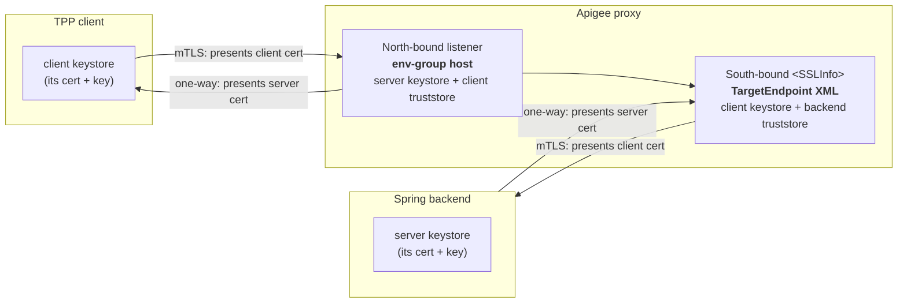

# 3.5 — TLS & mTLS: keystores, north- & south-bound

!!! bottomline "Bottom line"
    Every session so far secured the *message* — keys, tokens, JWTs. This one secures the *pipe*. A proxy has **two edges**, and each can run TLS independently: **north-bound** (client ⇄ Apigee) and **south-bound** (Apigee ⇄ backend). One-way TLS proves the *server's* identity; **mutual TLS (mTLS)** also proves the *client's*, using certificates held in **keystores** (your private key + cert) and **truststores** (the peer/CA certs you trust). By the end you can stand up both stores, configure south-bound mTLS in the TargetEndpoint's `<SSLInfo>`, and reference them so a cert rotation never needs a redeploy.

## Why this exists

In a Spring service you've configured each edge separately and probably never thought of them as a pair. The *inbound* edge is `server.ssl.*` — a keystore holding your service's private key and certificate, so clients get an HTTPS endpoint. The *outbound* edge is whatever your HTTP client trusts — a `RestTemplate`/`WebClient` built over an `SSLContext` with a custom truststore, so it'll talk to a backend with a private CA. Two different config blocks, two different mental models, and mutual TLS — where you *also* present a client cert outbound — was usually a fiddly `KeyManagerFactory` you set up once and feared touching.

Apigee makes both edges first-class and symmetric, because a gateway sits in the middle of two TLS conversations at once. North-bound, it is the *server* a client connects to (and optionally the *verifier* of the client's cert). South-bound, it is the *client* connecting to your backend (and optionally the *presenter* of a client cert the backend verifies). Same TLS primitives, mirror-image roles. Getting the roles straight — who proves identity to whom — is the entire skill here.

The reason mTLS matters for Open Banking is non-negotiable: FAPI 1.0 Advanced **requires** mutual TLS between the TPP and the API. The client certificate isn't just transport security; in 4.4 the access token gets *bound* to it, so a stolen bearer token is useless without the matching private key. So the certificate plumbing you build here is the foundation the later token-binding work stands on.

Finally, **references**. A keystore in Apigee is immutable once created — you can't edit a cert in place. To rotate without downtime you create a *new* keystore, then repoint a **reference** (a named, mutable pointer) at it. Your `<SSLInfo>` points at the reference, not the keystore, so rotation is a one-line control-plane update with no proxy redeploy.

!!! bridge "Spring Boot bridge"
    You've configured each of these edges in Spring; Apigee just names them and puts both under one roof.

    | Spring SSL config | Apigee X equivalent | Edge |
    |---|---|---|
    | `server.ssl.key-store` (your private key + cert) | env-group **keystore** at the host | north-bound (server) |
    | `server.ssl.client-auth=need` | north-bound **mTLS** (client-cert validation) | north-bound (mutual) |
    | `WebClient` over an `SSLContext` **truststore** | TargetEndpoint `<SSLInfo>` `<TrustStore>` | south-bound (verify backend) |
    | `KeyManagerFactory` presenting a client cert | TargetEndpoint `<SSLInfo>` `<KeyStore>`+`<KeyAlias>` + `<ClientAuthEnabled>` | south-bound (mutual) |
    | rebuilding the `SSLContext` to rotate a cert | repoint a keystore **reference** | both |

    The intuition "inbound keystore, outbound truststore" is exactly right. Apigee's twist is that *outbound* can also carry a keystore (the client cert it presents) and *inbound* can also carry a truststore (the client certs it accepts) — both edges can be mutual.

!!! breaks "Where the analogy breaks"
    Two things don't transfer. First, **north-bound TLS is terminated at the host, not in the proxy.** In Spring, `server.ssl` lives in the same app as your controllers, so it feels like one thing. In Apigee, the listener cert and north-bound mTLS are configured on the **environment group / host alias** — platform config *outside* any proxy bundle — while only the *south-bound* `<SSLInfo>` lives in the proxy XML. Don't go looking for the inbound keystore in `default.xml`; it isn't there. Second, **keystores are immutable.** There is no "edit the cert." A Spring habit of mutating a keystore file and restarting has no analogue — you create a new keystore and move a reference. Treat keystores as append-only and references as the only mutable handle.

## The concept

Two edges, two TLS conversations, mirror-image roles. North-bound, Apigee is the server (and optionally validates the client's cert). South-bound, Apigee is the client (and optionally presents its own cert to the backend). Each side has a place for a keystore (what *I* present) and a truststore (whose certs *I* trust).



Read it edge by edge. **North-bound** (left): the env-group host holds the *server* keystore (the cert clients see) and, for mTLS, a *truststore* of CA/client certs it will accept — `ClientAuthEnabled` at the host level. **South-bound** (right): the TargetEndpoint's `<SSLInfo>` holds a *truststore* (to verify the backend's server cert) and, for mTLS, a *keystore* + `<KeyAlias>` (the client cert Apigee presents) with `<ClientAuthEnabled>true`. The four certificate slots — two keystores, two truststores — are the whole picture; everything else is wiring.

The south-bound `<SSLInfo>` block is the one that lives in your proxy bundle. Its knobs:

- `<Enabled>true</Enabled>` — turn TLS on for this target (required for any `https://` URL).
- `<Enforce>true</Enforce>` — fail the handshake on cert problems instead of silently downgrading; always set this in production.
- `<TrustStore>` — the store of CA/server certs Apigee trusts to verify the *backend's* server certificate.
- `<ClientAuthEnabled>true</ClientAuthEnabled>` + `<KeyStore>` + `<KeyAlias>` — present *our* client cert for **mTLS**.

## Hands-on lab

<div class="lab" markdown="1">
#### Lab — south-bound mTLS to a backend, via references

**Prereqs:** `$ORG`, `$ENV`, `$TOKEN`, `$RUNTIME_HOST` exported, and a deployed proxy whose TargetEndpoint points at a backend that *requires* a client certificate (a Spring service with `server.ssl.client-auth=need`, or any mTLS-demanding endpoint). You'll create the client identity Apigee presents to it.

**1. Make a self-signed client cert + key** for Apigee to present south-bound, plus grab the backend's CA so Apigee can verify the backend:

```bash
openssl req -x509 -newkey rsa:2048 -nodes -days 365 \
  -keyout apigee-client.key -out apigee-client.crt \
  -subj "/CN=apigee-aisp-client/O=AISP"
# backend-ca.crt = the CA (or self-signed cert) that signed your backend's server cert
```

**2. Create a keystore and load the client cert+key under an alias.** The keystore is *what Apigee presents*; the alias names the keypair `<SSLInfo>` will select:

```bash
apigeecli keystores create --name aisp-south-ks --env "$ENV" --org "$ORG" --token "$TOKEN"

apigeecli keyaliases create --keystore aisp-south-ks --aliasName aisp-client \
  --format keycertfile --key apigee-client.key --cert apigee-client.crt \
  --env "$ENV" --org "$ORG" --token "$TOKEN"
```

**3. Create a truststore and load the backend's CA** so Apigee will trust the backend's *server* certificate during the handshake:

```bash
apigeecli keystores create --name aisp-south-ts --env "$ENV" --org "$ORG" --token "$TOKEN"

apigeecli keyaliases create --keystore aisp-south-ts --aliasName backend-ca \
  --format certonly --cert backend-ca.crt \
  --env "$ENV" --org "$ORG" --token "$TOKEN"
```

**4. Create a reference to the keystore** so you can rotate later without touching the proxy. The proxy will point at `aisp-south-ks-ref`, never at the keystore name directly:

```bash
apigeecli references create --name aisp-south-ks-ref \
  --refers aisp-south-ks --resourcetype KeyStore \
  --env "$ENV" --org "$ORG" --token "$TOKEN"
```

**5. Configure south-bound mTLS in the TargetEndpoint** (`targets/default.xml`). Note `ref://` for the keystore (rotatable) and `<Enforce>` so a bad handshake fails loudly:

```xml
<TargetEndpoint name="default">
  <HTTPTargetConnection>
    <URL>https://accounts-backend.internal:8443/accounts</URL>
    <SSLInfo>
      <Enabled>true</Enabled>
      <Enforce>true</Enforce>
      <ClientAuthEnabled>true</ClientAuthEnabled>
      <KeyStore>ref://aisp-south-ks-ref</KeyStore>
      <KeyAlias>aisp-client</KeyAlias>
      <TrustStore>aisp-south-ts</TrustStore>
    </SSLInfo>
  </HTTPTargetConnection>
</TargetEndpoint>
```

**6. Bundle, deploy, and call through a debug session** so the handshake shows up in Trace:

```bash
apigeecli apis create bundle --name aisp-accounts --proxy-folder ./aisp-accounts/apiproxy --org "$ORG" --token "$TOKEN"
apigeecli apis deploy --name aisp-accounts --org "$ORG" --env "$ENV" --ovr --wait --token "$TOKEN"

apigeecli apis debug create --name aisp-accounts --env "$ENV" --org "$ORG" --token "$TOKEN"
curl -s -o /dev/null -w "backend mTLS call: %{http_code}\n" \
  "https://$RUNTIME_HOST/aisp-accounts/accounts"
```

**What success looks like:** the **backend mTLS handshake succeeds in Trace** — the TargetEndpoint shows the request reaching the backend with a `200`, and the handshake step records the client certificate `aisp-client` being presented. Then prove rotation: create `aisp-south-ks-v2` with a fresh cert, repoint the reference with `apigeecli references update --name aisp-south-ks-ref --refers aisp-south-ks-v2 …`, and call again — it keeps working with **no redeploy**, because the proxy pointed at the reference, not the keystore.
</div>

## Verify it

In the Trace of a successful call, expand the TargetEndpoint request: the connection step should report `https`, the resolved `TrustStore`, and the presented `KeyAlias` (`aisp-client`). If `<ClientAuthEnabled>` were off, the backend (with `client-auth=need`) would reset the connection and Trace would show a handshake failure *before* any HTTP status — that absence-of-a-status is the fingerprint of a TLS-layer problem versus an application one.

Run two negative checks. Remove `backend-ca` from the truststore and redeploy: the handshake fails because Apigee can no longer verify the backend's server cert — proving the truststore is doing its job (the mirror of a Spring `WebClient` whose `SSLContext` lacks the backend CA). Then set `<Enforce>false</Enforce>` against a backend with a bad cert: the call may *silently* succeed over a downgraded connection — which is exactly why `<Enforce>true</Enforce>` is mandatory in production. Inline `curl -v` from a shell that has the client cert (`--cert apigee-client.crt --key apigee-client.key`) is a useful way to confirm the backend's mTLS expectation independently of Apigee.

!!! failure "Common failure modes"
    - **`Enabled` on but `Enforce` off.** Cert problems are swallowed and the connection silently downgrades. Symptom: "it works in eval but a man-in-the-middle would too." Always set `<Enforce>true</Enforce>`.
    - **mTLS configured at the wrong edge.** Putting client-cert config in `<SSLInfo>` secures *south-bound*; north-bound client-cert validation lives on the **env-group host**, not the proxy. Symptom: you wanted to validate the TPP's cert but configured the backend leg instead. Match the edge to the role.
    - **Editing a keystore in place.** Keystores are immutable; there's no update. Symptom: `apigeecli` errors trying to overwrite an alias, or a stale cert persists. Create a new keystore and move the **reference**.
    - **Truststore missing the peer CA.** South-bound, Apigee can't verify the backend's server cert; north-bound mTLS, it can't verify the client's. Symptom: `SSL handshake failed` / `unable to find valid certification path` in Trace, no HTTP status. Load the signing CA into the truststore.
    - **`<KeyAlias>` doesn't match the alias name.** `<SSLInfo>` selects the keypair by alias; a typo means no cert is presented. Symptom: backend resets an mTLS connection as if no cert arrived. Confirm the alias name from `keyaliases get`.

!!! stretch "Stretch goal"
    Stand up a minimal Spring Boot backend with `server.ssl.client-auth=need` and a self-signed server cert, then make the full south-bound mTLS round-trip work against it: load *its* CA into Apigee's truststore, present Apigee's `aisp-client` cert from the keystore, and watch the Spring app's logs show the peer certificate `CN=apigee-aisp-client` on the accepted connection. Then break it on purpose — present a *different* self-signed client cert that the Spring app's truststore doesn't trust — and confirm the handshake is rejected at the backend. That rejection is the same client-identity proof FAPI uses; in 4.4 you'll bind the access token to exactly this certificate.

## Recap & next

You can now reason about a proxy as **two independent TLS edges** with mirror-image roles: north-bound (Apigee as server, terminated at the env-group host, optionally validating client certs) and south-bound (Apigee as client, configured in the TargetEndpoint `<SSLInfo>`, optionally presenting a client cert). You built a keystore (what we present), a truststore (whom we trust), wired south-bound mTLS with `ClientAuthEnabled` + `KeyAlias` + `TrustStore`, and used a **reference** so a cert rotation is a control-plane update with no redeploy.

**Next — 3.6:** that south-bound target was a single hard-coded `https://` URL. You'll decouple the backend hostname from the proxy with **TargetServers** — externalised, environment-scoped backend definitions (the platform-config version of Spring Cloud LoadBalancer instances) — and add **load balancing across multiple targets with health monitoring**, so a sick backend is taken out of rotation automatically.
