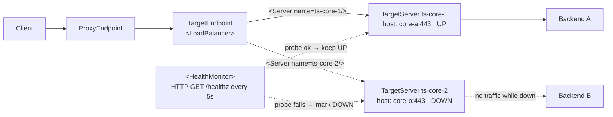

# 3.6 — TargetServers, load balancing & health

!!! bottomline "Bottom line"
    A **TargetServer** is an environment-scoped, named backend definition — host, port, enabled flag, optional TLS — that lives *outside* your proxy bundle. Your TargetEndpoint references it by name through a `<LoadBalancer>` instead of hard-coding a `<URL>`, so the same bundle promotes across environments with no code change. Add a `<HealthMonitor>` and Apigee actively probes each server, takes a sick one out of rotation, and fails over to the healthy one — all as platform config.

## Why this exists

Up to now your TargetEndpoint has pointed at a literal `<URL>https://backend.example.com</URL>` baked into the bundle. That works until the day you need the *same* proxy to hit a sandbox backend in `eval` and a production backend in `prod` — at which point a hard-coded URL forces you to fork the bundle per environment, or template it at build time. Both are exactly the kind of "config compiled into the artifact" coupling this course keeps pulling apart.

TargetServers move the hostname out of the artifact and into the environment. The bundle says "route to the load balancer named `aisp-core`"; the *environment* decides that `aisp-core` resolves to two servers in `eval` and four in `prod`. Promotion becomes "deploy the identical bundle" — the same separation you saw between control plane and runtime in 1.2, now applied to backend addressing.

The second reason is resilience. Once a logical backend is a *set* of named servers, Apigee can spread load across them and, with a `<HealthMonitor>`, stop sending traffic to one that's failing. You get connection-pool-level failover at the edge without a single line in your Spring app or a sidecar.

!!! bridge "Spring Boot bridge"
    TargetServers are the platform-config version of **Spring Cloud LoadBalancer** `ServiceInstance`s. You already know the shape; here's the mapping:

    | Spring Cloud LoadBalancer | Apigee X |
    |---|---|
    | A `ServiceInstance` (host + port + metadata) | A **TargetServer** (`name`, `host`, `port`, `isEnabled`, optional `SSLInfo`) |
    | The instance list behind a service id | The set of `<Server>`s inside one `<LoadBalancer>` |
    | `ReactorLoadBalancer` round-robin / weighting | `<LoadBalancer><Algorithm>` (RoundRobin, Weighted, LeastConnections) |
    | A discovery client / registry | The **environment** itself — TargetServers are env-scoped objects |
    | Spring Retry / circuit breaker tripping an instance | `<MaxFailures>` + `<HealthMonitor>` ejecting a server |

    The intuition "a logical service name fans out to interchangeable instances, and unhealthy ones get pulled" carries over almost exactly.

!!! breaks "Where the analogy breaks"
    Spring Cloud LoadBalancer is *client-side* — your app holds the instance list, picks one, and calls it; the balancing logic runs inside your JVM. Apigee balances at the **edge**, before the request reaches any of your code, and the server list is platform config you never compile or ship. There's also no registry round-trip: TargetServers are declared, not discovered, so there's no service-discovery freshness or heartbeat-registration story to reason about — the `<HealthMonitor>` probe *is* the liveness signal, and it's Apigee's job, not your app's. Don't go looking for an Eureka-style registry; the "registry" is the environment's TargetServer list, edited by config.

## The concept

A TargetServer is a tiny object: a `name`, a `host`, a `port`, an `isEnabled` flag, and optional `SSLInfo` for south-bound TLS (from 3.5). It's scoped to one environment. Your TargetEndpoint stops naming a URL and instead names a `<LoadBalancer>` of one or more `<Server>`s, each referencing a TargetServer by name. `<MaxFailures>` says how many consecutive I/O errors retire a server; a `<HealthMonitor>` actively probes each one (TCP or HTTP) so a server can be marked down *before* a real request ever hits it — and brought back when it recovers.



Read it as: the LoadBalancer fans the request across `ts-core-1` and `ts-core-2`; the HealthMonitor independently probes both; when `ts-core-2`'s probe fails it's pulled from rotation, so every live request lands on `ts-core-1` until `ts-core-2`'s probe recovers. The proxy bundle names only `ts-core-1` / `ts-core-2` — what host each resolves to is environment config.

!!! pitfall "Watch out"
    Because a TargetServer is **environment-scoped**, the same bundle that deploys cleanly to `eval` will fail in `prod` if you never created `ts-core-1` there — the names resolve to nothing. Recreate every TargetServer your `<LoadBalancer>` references in *each* environment you promote to, or the proxy 502s only in the new env.

## Hands-on lab

<div class="lab" markdown="1">
#### Lab — two TargetServers, a LoadBalancer, and active health checks

**Prereqs:** `$ORG`, `$ENV`, `$TOKEN`, `$RUNTIME_HOST` exported, and a proxy you can edit (reuse `aisp-accounts` from 3.2, or any proxy with a TargetEndpoint). We'll point both servers at Apigee's mock target so the lab is self-contained, then disable one to force failover.

**1. Create two TargetServers** in the environment. They're env-scoped config, not part of the bundle:

```bash
apigeecli targetservers create \
  --name ts-core-1 --host mocktarget.apigee.net --port 443 --enable=true \
  --org "$ORG" --env "$ENV" --token "$TOKEN"

apigeecli targetservers create \
  --name ts-core-2 --host mocktarget.apigee.net --port 443 --enable=true \
  --org "$ORG" --env "$ENV" --token "$TOKEN"

apigeecli targetservers list --org "$ORG" --env "$ENV" --token "$TOKEN"
```

**2. Switch the TargetEndpoint from a hard URL to a LoadBalancer.** In `targets/default.xml`, replace the `<HTTPTargetConnection><URL>…</URL>` with a `<LoadBalancer>` over the two named servers. `<MaxFailures>1` retires a server after a single I/O failure; `<HealthMonitor>` actively probes them:

```xml
<TargetEndpoint name="default">
  <HTTPTargetConnection>
    <LoadBalancer>
      <Algorithm>RoundRobin</Algorithm>
      <Server name="ts-core-1"/>
      <Server name="ts-core-2"/>
      <MaxFailures>1</MaxFailures>
    </LoadBalancer>
    <Path>/json</Path>
    <HealthMonitor>
      <IsEnabled>true</IsEnabled>
      <IntervalInSec>5</IntervalInSec>
      <HTTPMonitor>
        <Request>
          <ConnectTimeoutInSec>2</ConnectTimeoutInSec>
          <SocketReadTimeoutInSec>2</SocketReadTimeoutInSec>
          <Port>443</Port>
          <Verb>GET</Verb>
          <Path>/json</Path>
        </Request>
        <SuccessResponse>
          <ResponseCode>200</ResponseCode>
        </SuccessResponse>
      </HTTPMonitor>
    </HealthMonitor>
  </HTTPTargetConnection>
</TargetEndpoint>
```

Note there is **no `<SSLInfo>` here** — TLS for a `<LoadBalancer>` is configured per TargetServer (the `SSLInfo` on the TargetServer object), not on the connection. For HTTPS to the mock target, add TLS to each TargetServer when you create it; for this self-contained lab the mock target accepts the probe on 443.

!!! pitfall "Watch out"
    Switching to a `<LoadBalancer>` means deleting the old hard `<URL>` — a TargetEndpoint can carry one or the other, never both. If you leave the `<URL>` in, deploy validation fails or the URL silently wins and your named servers are never consulted, so failover quietly does nothing.

**3. Bundle and deploy:**

```bash
apigeecli apis create bundle --name aisp-accounts --proxy-folder ./aisp-accounts/apiproxy \
  --org "$ORG" --token "$TOKEN"
apigeecli apis deploy --name aisp-accounts --org "$ORG" --env "$ENV" --ovr --wait --token "$TOKEN"
```

**4. Confirm both serve traffic.** Fire several requests; round-robin spreads them across the two servers (both currently healthy, so every call succeeds):

```bash
for i in $(seq 1 6); do
  curl -s -o /dev/null -w "call $i: %{http_code}\n" "https://$RUNTIME_HOST/aisp-accounts/accounts"
done
```

**5. Force a failover.** Disable one TargetServer — no redeploy, just flip its `isEnabled` flag — and watch traffic survive entirely on the other:

```bash
apigeecli targetservers update \
  --name ts-core-2 --host mocktarget.apigee.net --port 443 --enable=false \
  --org "$ORG" --env "$ENV" --token "$TOKEN"

for i in $(seq 1 6); do
  curl -s -o /dev/null -w "call $i: %{http_code}\n" "https://$RUNTIME_HOST/aisp-accounts/accounts"
done
```

**What success looks like:** in step 4 all six calls return `200`. In step 5, with `ts-core-2` disabled, all six *still* return `200` — every request now lands on `ts-core-1`, and not one fails despite half the pool being down. Re-enable `ts-core-2` and traffic spreads across both again. You changed a backend's availability with a single config call and zero bundle changes — that's the whole point.
</div>

## Verify it

Open a debug session (`apigeecli apis debug create --name aisp-accounts --env "$ENV" --org "$ORG" --token "$TOKEN"`) and send a request while both servers are up. In the Trace, the target execution shows which `<Server>` was selected — alternate calls flip between `ts-core-1` and `ts-core-2`, proving `RoundRobin` is live. Disable `ts-core-2` and trace again: every selection now reads `ts-core-1`, and the disabled server simply never appears.

You can also confirm the HealthMonitor is doing work independently of real traffic: with `<IntervalInSec>5` and a server whose `<HealthMonitor>` probe path returns non-200, that server is marked down within a probe cycle *before* any client request would have hit it — failover happens proactively, not on the first failed user call.

!!! pitfall "Watch out"
    Without a `<HealthMonitor>`, a dead server stays in rotation until `<MaxFailures>` consecutive real requests fail — every one of those failures is a user request you served a 5xx. Note too that a *disabled* TargetServer still counts as part of the LoadBalancer's config; don't read "I disabled it" as "the LoadBalancer no longer knows about it."

!!! failure "Common failure modes"
    - **Leaving the `<URL>` in.** A TargetEndpoint can have a `<URL>` *or* a `<LoadBalancer>`, not both. Symptom: deploy fails validation, or the URL silently wins and your servers are never consulted.
    - **TargetServer in the wrong environment.** TargetServers are env-scoped. A bundle that deploys clean to `eval` fails in `prod` because `ts-core-1` was never created there. Symptom: `502` / "no target server" only in the new env.
    - **Expecting `<SSLInfo>` on the LoadBalancer connection.** South-bound TLS for a balanced target lives on each **TargetServer's** `SSLInfo`, not on `<HTTPTargetConnection>`. Symptom: HTTPS handshake errors despite "configuring TLS" on the wrong object.
    - **HealthMonitor probing a path the backend doesn't serve.** If the probe `<Path>` 404s, a healthy server is marked down and ejected. Symptom: all servers down, 503s, even though the backend is fine — the probe, not the backend, is misconfigured.
    - **`<MaxFailures>0` with no HealthMonitor.** Zero means "never retire on failure," so a dead server stays in rotation and keeps eating requests. Pair a sensible `<MaxFailures>` with a HealthMonitor for real failover.

!!! stretch "Stretch goal"
    Create two TargetServers pointing at *different* hosts — one reachable, one deliberately broken (a bad port or a path that 404s the probe) — give the LoadBalancer an `<HTTPMonitor>` with a 5-second interval, and deploy. Open a Trace and send a steady trickle of requests while you toggle the broken server's `isEnabled`. Watch the selected `<Server>` in each trace flip the moment the HealthMonitor marks one down or up. Then write down what you'd have to build in Spring Cloud LoadBalancer + Resilience4j to get the same proactive ejection — and notice none of it shipped in your proxy bundle.

## Recap & next

You can now lift backend hostnames out of the bundle into environment-scoped **TargetServers**, point a TargetEndpoint at a `<LoadBalancer>` of named `<Server>`s instead of a hard `<URL>`, spread load with an `<Algorithm>`, and add a `<HealthMonitor>` that proactively ejects a failing server and fails over to a healthy one — all without touching proxy code. That decoupling is what makes promotion across environments (which you'll formalise in 6.1) a redeploy of the *identical* artifact.

**Next — 3.7:** the Part-3 capstone. You'll extract cross-cutting policy logic into **shared flows**, attach them platform-wide with **FlowHooks** so every proxy inherits them, and design a predictable **fault taxonomy** — RaiseFault, FaultRules, and a consistent error envelope — that sets up FAPI error handling in Part 4.
