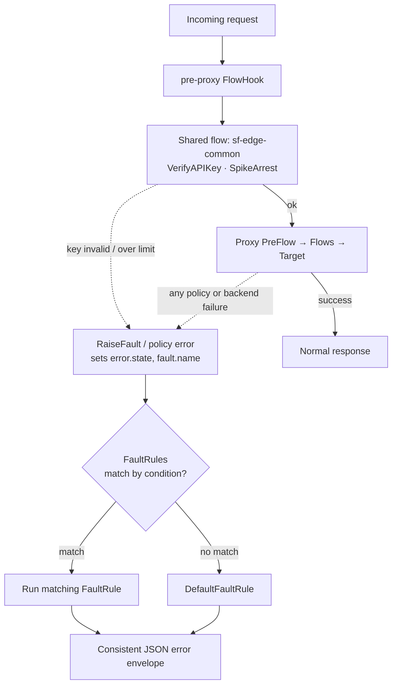

# 3.7 — Shared flows, FlowHooks & the fault taxonomy

!!! bottomline "Bottom line"
    A **shared flow** is a reusable bundle of policies you author once and call from many proxies; a **FlowHook** attaches one at the *environment* level so **every** proxy in that environment inherits it — no per-proxy edit. Pair that with a deliberate **fault taxonomy** — RaiseFault to throw, FaultRules to catch, and one DefaultFaultRule to render a consistent error envelope — and you have platform-wide cross-cutting concerns plus a single, predictable error shape. This is the Part-3 capstone, and it's what FAPI in Part 4 will build on.

## Why this exists

By now you've written the same three policies — verify the key, throttle the caller, stamp a correlation header — into more than one proxy. Copy-paste across proxies is exactly the duplication that, in Spring, you'd refuse to tolerate: you'd pull it into a filter and register it once. Apigee's answer is the **shared flow**: a named, versioned bundle of policies that any proxy can invoke with a **FlowCallout**, and that an environment can apply to *all* proxies with a **FlowHook**.

The FlowHook is the part with no per-proxy footprint. You attach a shared flow to one of four environment-level positions — pre-proxy, pre-target, post-target, post-proxy — and from then on every proxy deployed to that environment runs it, whether or not the proxy author knows it exists. That's how a platform team enforces "every API in prod verifies a key and emits an audit log" without trusting thirty proxy authors to remember.

The other half is error handling. Spring services converge on *one* error contract — a problem-detail JSON body — via `@ExceptionHandler` / `@ControllerAdvice`, so callers never see a raw stack trace or an inconsistent shape. Apigee gives you the same discipline through **RaiseFault** (deliberately throw), **FaultRules** (catch by condition), a **DefaultFaultRule** (the catch-all), and the `fault.*` / `error.*` variables that tell you what went wrong. Designing that taxonomy now means Open Banking's prescribed error formats in Part 4 slot straight in.

!!! bridge "Spring Boot bridge"
    Two Spring patterns map almost one-to-one:

    | Spring pattern | Apigee X equivalent |
    |---|---|
    | An `OncePerRequestFilter` registered once for the whole app | A **shared flow** attached via a **pre-proxy FlowHook** — runs for every proxy in the env |
    | Calling shared logic from a controller (`service.doX()`) | A **FlowCallout** invoking a shared flow from inside one proxy |
    | `@ControllerAdvice` / `@ExceptionHandler` | **FaultRules** + **DefaultFaultRule** rendering one error shape |
    | `throw new ApiException(...)` | A **RaiseFault** policy raising a typed fault |
    | The exception object's fields you inspect | `fault.name`, `error.status.code`, `error.message`, `message.content` |

    If you've ever written one `@ControllerAdvice` so every endpoint returns the same `{ "error": ... }` body, a DefaultFaultRule is that idea promoted to the gateway.

!!! breaks "Where the analogy breaks"
    A Spring filter chain is one ordered list you can read top to bottom in code. FlowHook logic is **invisible from the proxy** — nothing in the proxy bundle references the shared flow a FlowHook attaches, so a proxy author can run policies they never see and can't easily diff. That's powerful for governance and a genuine debugging trap: a request can be rejected by a pre-proxy FlowHook before the proxy's own PreFlow runs, and the proxy XML gives no hint why. There's also no exception *object* that propagates — Apigee has flow variables (`fault.*`, `error.*`) and a flag (`error.state`), not a typed throwable, so a FaultRule matches on string/variable **conditions**, not on `catch (SomeException e)`. Stop looking for a stack trace to catch; look for the fault name and the `error.*` variables.

## The concept

A shared flow is its own bundle (a `sharedflowbundle/` directory) with policies and a single flow definition. Proxies reach it two ways: explicitly, via a `<FlowCallout>` step inside the proxy; or implicitly, via a **FlowHook** that binds the shared flow to an environment position so it runs for every proxy. The four FlowHook positions mirror the four attach points from 2.1: **pre-proxy** (before any proxy PreFlow), **pre-target**, **post-target**, **post-proxy** (after every proxy PostFlow).

On the fault side: any policy failure, or an explicit **RaiseFault**, sets `error.state` and populates `fault.name` and the `error.*` variables. Apigee then walks **FaultRules** (each a `<Condition>` over those variables) in order, runs the first match, and if none match runs the **DefaultFaultRule** — your catch-all that builds the consistent error body. That's how every failure, from a 401 to a backend 503, leaves through the same shaped response.

!!! pitfall "Watch out"
    A FlowHook attaches at the **environment** level, so it runs for *every* proxy in that env — the blast radius is the whole environment, not one API. Anything heavy, slow, or wrong in a pre-proxy shared flow degrades or breaks every proxy at once, including ones whose authors never knew the hook existed. Test the shared flow in a non-prod env before you attach the hook in prod.



Read it as: the FlowHook runs `sf-edge-common` for every proxy *before* the proxy's own logic; on success the proxy proceeds, on failure (here, or anywhere downstream) the fault path engages, FaultRules try to match, and whatever doesn't match falls to the DefaultFaultRule — so all errors exit through one envelope.

## Hands-on lab

<div class="lab" markdown="1">
#### Lab — extract a shared flow, attach a FlowHook, render one error shape

**Prereqs:** `$ORG`, `$ENV`, `$TOKEN`, `$RUNTIME_HOST` exported, the Developer/App/Product chain from 3.2 (so VerifyAPIKey has something to validate), and a deployed proxy in `$ENV`.

**1. Build a shared flow bundle.** Create `sf-edge-common/sharedflowbundle/` with two policies and one flow. First the policies — `VerifyAPIKey` and `SpikeArrest`, the cross-cutting pair you keep duplicating:

```xml
<!-- sharedflowbundle/policies/VK-Key.xml -->
<VerifyAPIKey name="VK-Key">
  <APIKey ref="request.header.x-api-key"/>
</VerifyAPIKey>
```
```xml
<!-- sharedflowbundle/policies/SA-Edge.xml -->
<SpikeArrest name="SA-Edge">
  <Rate>20ps</Rate>
</SpikeArrest>
```

The flow definition wires them in order:

```xml
<!-- sharedflowbundle/sharedflows/default.xml -->
<SharedFlow name="default">
  <Step><Name>SA-Edge</Name></Step>
  <Step><Name>VK-Key</Name></Step>
</SharedFlow>
```

And the bundle descriptor:

```xml
<!-- sharedflowbundle/sf-edge-common.xml -->
<SharedFlowBundle name="sf-edge-common"/>
```

**2. Upload and deploy the shared flow** — it's a first-class deployable, like a proxy:

```bash
apigeecli sharedflows create bundle --name sf-edge-common \
  --folder ./sf-edge-common/sharedflowbundle --org "$ORG" --token "$TOKEN"
apigeecli sharedflows deploy --name sf-edge-common --env "$ENV" --ovr --wait \
  --org "$ORG" --token "$TOKEN"
```

**3. Attach it as a pre-proxy FlowHook** at the environment level. Now every proxy in `$ENV` runs `sf-edge-common` before its own PreFlow — no proxy edits:

```bash
apigeecli flowhooks attach --name PreProxyFlowHook \
  --sharedflow sf-edge-common --env "$ENV" --org "$ORG" --token "$TOKEN"

apigeecli flowhooks list --env "$ENV" --org "$ORG" --token "$TOKEN"
```

**4. Add a consistent error envelope** so a failed key (or anything) returns one shape, not Apigee's default. In your proxy's `proxies/default.xml`, add a `<DefaultFaultRule>` plus an `AssignMessage` that builds the body:

```xml
<!-- policies/FC-ErrorEnvelope.xml -->
<AssignMessage name="FC-ErrorEnvelope">
  <Set>
    <Payload contentType="application/json">{
  "errorCode": "{fault.name}",
  "errorMessage": "{error.message}",
  "interactionId": "{request.header.x-fapi-interaction-id}"
}</Payload>
    <StatusCode>{error.status.code}</StatusCode>
  </Set>
  <Set><Headers><Header name="Content-Type">application/json</Header></Headers></Set>
</AssignMessage>
```
```xml
<!-- inside proxies/default.xml, on the ProxyEndpoint -->
<DefaultFaultRule name="all-faults">
  <Step><Name>FC-ErrorEnvelope</Name></Step>
</DefaultFaultRule>
```

!!! pitfall "Watch out"
    FaultRules evaluate top-down and the **first** matching one wins — so order them specific → general. Put the broad catch-all `<FaultRule>` above your `SpikeArrestViolation` rule and the catch-all shadows it: your custom 429 body never renders because a more general rule matched first.

For a *targeted* rule — say, a custom 429 body only when SpikeArrest trips — add a `<FaultRule>` with a condition before the default:

```xml
<FaultRule name="rate-limited">
  <Condition>fault.name = "SpikeArrestViolation"</Condition>
  <Step><Name>FC-ErrorEnvelope</Name></Step>
</FaultRule>
```

**5. Redeploy the proxy and test the fault path:**

```bash
apigeecli apis create bundle --name aisp-accounts --proxy-folder ./aisp-accounts/apiproxy \
  --org "$ORG" --token "$TOKEN"
apigeecli apis deploy --name aisp-accounts --org "$ORG" --env "$ENV" --ovr --wait --token "$TOKEN"

# no key → the FlowHook's VerifyAPIKey fails → your envelope renders
curl -s "https://$RUNTIME_HOST/aisp-accounts/accounts" \
  -H "x-fapi-interaction-id: $(uuidgen)" -i
```

**What success looks like:** the no-key call returns a `401` whose body is your envelope — `{ "errorCode": "...", "errorMessage": "...", "interactionId": "..." }` — even though you never added VerifyAPIKey to *this* proxy; the **FlowHook** supplied it. Add a second throwaway proxy, deploy it with no security policies of its own, and it too rejects keyless calls through the same envelope. One shared flow, one error shape, zero per-proxy duplication.
</div>

## Verify it

Open a debug session on the proxy and send a keyless request. In the Trace you'll see the **shared flow execute before the proxy's own PreFlow** — `SA-Edge` and `VK-Key` appear as a `FlowHook` segment that no policy in the proxy bundle references. That's the FlowHook running invisibly, exactly as designed. When `VK-Key` fails, `error.state` flips and the trace jumps to the fault path, landing on your `DefaultFaultRule` and `FC-ErrorEnvelope`.

Confirm the taxonomy is discriminating, not just catching everything the same way. Send a burst that trips SpikeArrest and check the response: with the `rate-limited` FaultRule in place, `fault.name = "SpikeArrestViolation"` matches *before* the DefaultFaultRule, so the 429 path is the one that ran. Inspect `fault.name`, `error.status.code`, and `error.message` in the Trace at the moment the fault raised — those three variables are the whole basis on which your FaultRule conditions decide.

!!! pitfall "Watch out"
    Once you're in a fault, the normal request/response flow is abandoned — a **RaiseFault** stops the current flow immediately, and the policies you scheduled in PreFlow or PostFlow simply don't run. Anything that *must* happen on the error path (your envelope, an audit log) has to live inside a FaultRule or the DefaultFaultRule, not in the normal flow steps.

!!! failure "Common failure modes"
    - **Looking in the proxy for FlowHook logic.** A pre-proxy FlowHook rejects a request before the proxy's PreFlow, and nothing in the proxy XML references it. Symptom: "my proxy has no VerifyAPIKey but keyless calls still 401" — that's the FlowHook, found via `flowhooks list`, not the bundle.
    - **Shared flow not deployed to the environment.** A FlowHook references a shared flow that isn't deployed to that env. Symptom: every proxy in the env errors at runtime, or the attach call rejects the name. Deploy the shared flow first, then attach the hook.
    - **FaultRule order / condition wrong.** FaultRules evaluate top-down, first match wins; a too-broad condition early on shadows a specific one below it. Symptom: your custom 429 body never appears because a catch-all FaultRule above it matched first.
    - **Expecting the DefaultFaultRule to run when a FaultRule matched.** Unlike a normal PostFlow, once a FaultRule matches, the DefaultFaultRule is skipped (unless `AlwaysEnforce` is set). Symptom: envelope logic you put only in the DefaultFaultRule is missing on matched-rule errors.
    - **Reading `error.*` outside the fault path.** `fault.name` / `error.message` are only meaningful after `error.state` is set. Symptom: empty `errorCode` in the envelope because the AssignMessage ran on the success path, not as a fault handler.

!!! stretch "Stretch goal"
    Find three proxies (or three copies of one) that each repeat the same VerifyAPIKey + SpikeArrest + correlation-header policies. Refactor all three into a single shared flow attached by **one** pre-proxy FlowHook, then delete those policies from each proxy and redeploy. Prove the behaviour is identical via Trace, then count the lines of XML you removed. Finally, map the result onto your Spring world: which `OncePerRequestFilter` and which `@ControllerAdvice` would this replace, and what governance guarantee does an env-level FlowHook give a platform team that a per-service filter never could?

## Recap & next

You can now extract cross-cutting policy logic into a deployable **shared flow**, invoke it explicitly with a **FlowCallout** or apply it to every proxy in an environment with a **FlowHook** at one of the four positions, and you've designed a deliberate **fault taxonomy** — **RaiseFault** to throw, **FaultRules** with conditions to catch, a **DefaultFaultRule** as the catch-all, and the `fault.*` / `error.*` variables — so every failure leaves through one consistent JSON envelope. That closes Part 3: you've gone from a bare passthrough to a governed, resilient, uniformly-erroring edge.

**Next — 4.1:** Part 4 opens on the domain this course has been pointing at all along — the **UK Open Banking trust framework and the OBIE roles** (ASPSP, AISP, PISP, the directory). The shared-flow-and-fault discipline you just built is exactly where FAPI's prescribed security headers, consent checks, and standardised error formats will live.
