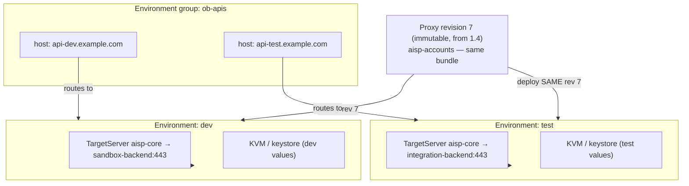

# 6.1 — Environments, env groups & hostnames

!!! bottomline "Bottom line"
    Promotion in Apigee is **deploy the same immutable revision (from 1.4) into the next environment** — and change nothing in the bundle. The environment carries its own config: **TargetServers, KVMs, keystores** are env-scoped, so the *identical* revision talks to a different backend in `dev` than in `test`. **Environment groups** map a hostname onto one or more environments, so routing is platform config too. By the end you can deploy one revision to two environments and watch it serve two backends, with zero code change.

## Why this exists

In Spring you already promote a *single artifact* across stages: the same `app.jar` runs in dev, test, and prod, and the only thing that changes is which `application-{profile}.yml` and which secrets it picks up. The build is immutable; the environment is configurable. Apigee holds exactly that principle — but enforces it structurally, because the proxy **revision** is immutable by design (1.4) and the environment owns everything that should differ.

The thing worth slowing down for is *what* "the environment" owns. It is not just a flag you flip. An environment is a hard isolation boundary (1.2) with its own **TargetServers** (3.6), its own **KVMs** (2.7), and its own **keystores** (3.5). When you deploy revision 7 of `aisp-accounts` to `dev` and to `test`, the bundle is byte-for-byte identical — but `dev` resolves the TargetServer `aisp-core` to the sandbox backend and `test` resolves it to the integration backend. The revision didn't change; its environment did.

Routing is the other half. A client doesn't call "an environment" — it calls a **hostname**, and an **environment group** is the object that maps that hostname to the environments behind it. This is the platform's answer to an ingress: instead of a separate ingress controller mapping `api.dev.example.com` to one set of pods, the env group lives *inside* Apigee and routes the host to the environment. That's why `$RUNTIME_HOST` (1.2) is per env-group, not per environment.

!!! bridge "Spring Boot bridge"
    You already do immutable-artifact promotion; Apigee promotes the same way, but the env owns the config as first-class objects rather than YAML you bake in:

    | Spring promotion mechanic | Apigee X equivalent | What changes between dev and test |
    |---|---|---|
    | The same `app.jar` across stages | The same **proxy revision** (immutable, 1.4) | Nothing — it's the same artifact |
    | `application-dev.yml` vs `application-test.yml` | The **environment's** KVMs / PropertySets (2.7) | Per-env values, read at runtime |
    | `spring.datasource.url` per profile | The **TargetServer** the env resolves (3.6) | A different backend host per env |
    | Per-profile keystore / truststore | The **environment's keystore** (3.5) | Different certs/keys per env |
    | Ingress host → a profile's pods | An **environment group** → environment(s) | The hostname clients hit (`$RUNTIME_HOST`) |

    "Build once, configure per environment" is the whole idea you already hold. Apigee just makes the config a set of addressable platform resources instead of strings in a jar.

!!! breaks "Where the analogy breaks"
    A Spring profile is selected *inside one running process* — same JVM, different beans. Apigee environments are **physically separate deployment scopes**: the revision genuinely does not exist in `test` until you deploy it there, and `test`'s TargetServers and KVMs are invisible from `dev`. There is also no Spring-native equivalent for the **environment group** — hostname routing in Spring is your ingress controller's job, outside the framework, whereas here it is config *inside the platform*. The trap is expecting a value, secret, or proxy to be visible where it was never deployed: promotion is an explicit act per environment, not a profile string that travels with the artifact.

## The concept

You met the `org → environment → environment group → instance` hierarchy in 1.2. Promotion lives inside it: one immutable revision, deployed into successive environments, behaving differently because each environment resolves its own env-scoped config.



Read it as: the **same** revision 7 is deployed into both `dev` and `test`. The bundle references the TargetServer `aisp-core` *by name* (3.6) — it never names a URL — so `dev` sends traffic to the sandbox backend and `test` to the integration backend, purely because each environment defines `aisp-core` differently. The **environment group** `ob-apis` owns both hostnames and routes each to its environment. Promotion = the `deploy` arrow on the right, repeated; nothing on the artifact changes.

## Hands-on lab

<div class="lab" markdown="1">
#### Lab — one revision, two environments, two backends

**Prereqs:** `$ORG`, `$ENV`, `$TOKEN`, `$RUNTIME_HOST` exported (1.2), and a deployed proxy `aisp-accounts` whose TargetEndpoint routes to a **LoadBalancer over a named TargetServer** `aisp-core` (the 3.6 pattern, not a hard-coded `<URL>`). If yours still hard-codes a URL, switch it first — promotion only works when the backend is named, not embedded.

**1. Identify (or create) a second environment.** Eval orgs ship one env; a second environment is what makes promotion demonstrable. List what you have, then add `test` if it's missing:

```bash
apigeecli envs list --org "$ORG" --token "$TOKEN"

# create a second environment if you only have one
apigeecli environments create --name test --deptype PROXY \
  --org "$ORG" --token "$TOKEN"
```

Treat your existing eval env as `dev` for this lab: `export DEV_ENV="$ENV"` and `export TEST_ENV="test"`.

**2. Define the TargetServer `aisp-core` differently in each environment.** Same name, same role — different host. This is the entire trick: the bundle references the name, the environment supplies the address.

```bash
# dev → the sandbox backend
apigeecli targetservers create --name aisp-core \
  --host mocktarget.apigee.net --port 443 --enable=true \
  --org "$ORG" --env "$DEV_ENV" --token "$TOKEN"

# test → a different backend, SAME TargetServer name
apigeecli targetservers create --name aisp-core \
  --host httpbin.org --port 443 --enable=true \
  --org "$ORG" --env "$TEST_ENV" --token "$TOKEN"
```

**3. Deploy the *same* immutable revision to both environments.** Build the bundle once, deploy it into `dev`, then deploy the **identical** revision number into `test` — no rebuild between them:

```bash
apigeecli apis create bundle --name aisp-accounts \
  --proxy-folder ./aisp-accounts/apiproxy --org "$ORG" --token "$TOKEN"

# deploy to dev and capture the revision that was created
REV="$(apigeecli apis deploy --name aisp-accounts --env "$DEV_ENV" \
  --ovr --wait --org "$ORG" --token "$TOKEN" | jq -r '.revision // .deployments[0].revision')"
echo "deployed revision: $REV"

# promote the SAME revision to test — note --rev, no rebuild
apigeecli apis deploy --name aisp-accounts --env "$TEST_ENV" --rev "$REV" \
  --ovr --wait --org "$ORG" --token "$TOKEN"
```

**4. Map hostnames with an environment group.** Attach both environments to one group so each gets its own host. (Custom hostnames need DNS + a cert you own; for the lab the env-group hostname Apigee assigns is enough — list it back.)

```bash
# attach the test env to your existing env group (dev is already attached)
GROUP="$(apigeecli environments groups list --org "$ORG" --token "$TOKEN" \
  | jq -r '.environmentGroups[0].name')"

apigeecli environments groups attach --name "$GROUP" --env "$TEST_ENV" \
  --org "$ORG" --token "$TOKEN"

# read back the hostname clients hit per group
apigeecli environments groups get --name "$GROUP" --org "$ORG" --token "$TOKEN" \
  | jq '{name, hostnames, environments: [.environmentGroupConfig?]}'
```

**What success looks like:** `apigeecli apis listdeploy --name aisp-accounts --org "$ORG" --token "$TOKEN"` shows the **same revision number** deployed in *both* `dev` and `test`. The same revision serves **different backends** per environment purely via the `aisp-core` TargetServer — proven in Verify it. No bundle was rebuilt between the two deploys.
</div>

## Verify it

Prove the env-scoped config — not the bundle — is what differs. Hit the proxy through each environment's hostname and confirm the responses came from *different* backends, even though `apis listdeploy` reports an identical `$REV` in both.

```bash
# dev → routed to the sandbox TargetServer
curl -s "https://$RUNTIME_HOST/aisp-accounts/accounts" -H "x-fapi-interaction-id: $(uuidgen)" -i | head -5

# confirm both envs run the SAME revision
apigeecli apis listdeploy --name aisp-accounts --org "$ORG" --token "$TOKEN" \
  | jq '.deployments[] | {environment, revision}'
```

You should see one `revision` value repeated for both `environment` entries. Then change `dev`'s `aisp-core` host with `apigeecli targetservers update --name aisp-core --host some-other-host --port 443 --org "$ORG" --env "$DEV_ENV" --token "$TOKEN"` and re-call: the backend changes with **no redeploy and no new revision**, because the address lives in the environment, not the artifact. That is promotion working — the revision is inert; the environment is the variable.

!!! failure "Common failure modes"
    - **Hard-coded `<URL>` in the TargetEndpoint.** Then `dev` and `test` literally cannot differ without a new bundle. Symptom: both environments hit the same backend no matter what the TargetServers say. Reference a named TargetServer (3.6) instead.
    - **TargetServer missing in the second env.** TargetServers are env-scoped (1.2); creating `aisp-core` in `dev` does *not* create it in `test`. Symptom: the proxy deploys fine but throws a target-resolution/`502` only in `test`. Create the TargetServer in **every** environment the revision is deployed to.
    - **Rebuilding between deploys.** Calling `apis create bundle` again before the `test` deploy makes a *new* revision, so you're no longer promoting the same artifact. Symptom: `listdeploy` shows different revisions per env. Capture `$REV` once and deploy it with `--rev`.
    - **Env not attached to a group.** A proxy deployed to `test` with no env-group routing has no hostname. Symptom: deploy succeeds but the host returns `404`/no route. Attach the environment to an env group.
    - **Expecting a KVM/keystore to carry over.** Like TargetServers, KVMs (2.7) and keystores (3.5) are env-scoped. Symptom: a token/cert that resolves in `dev` is absent in `test`. Provision the env-scoped config in each environment before promoting.

!!! stretch "Stretch goal"
    Promote a proxy from `dev` to `test` with **no bundle change** — only environment configuration. Pick a proxy that reads one value from a KVM and routes via a TargetServer. Provision *different* KVM values and a *different* TargetServer host in `test`, deploy the existing `$REV` with `--rev`, and confirm the behaviour differs across the two environments without ever running `apis create bundle`. Then write down which of your current Spring per-profile settings would become a TargetServer, which a KVM, and which a keystore — that mapping is your promotion checklist for 6.2.

## Recap & next

You can now explain why promotion in Apigee is **deploy the same immutable revision into the next environment** and change nothing in the bundle: TargetServers, KVMs, and keystores are **env-scoped**, so one revision serves different backends per environment. You attached an environment to an **environment group** so each gets a routable hostname, and you proved the bundle never changed by deploying one `$REV` to two environments.

**Next — 6.2:** you've been promoting by hand. Now make it a pipeline — proxy bundles, shared flows, and env config in **git**, linted with **apigeelint**, built and deployed by **apigeecli** in **CI/CD**, with per-environment promotion gates. Your gateway config becomes a versioned artifact in a workflow, exactly like your Spring app's.
