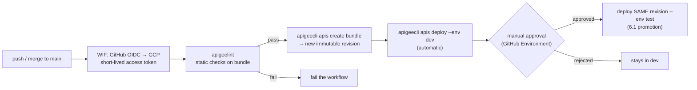

# 6.2 — CI/CD & config-as-code

!!! bottomline "Bottom line"
    Your proxy bundle, shared flows, and env config are just files in **git** — so they belong in a pipeline like any other artifact. **apigeelint** is your static analysis; **apigeecli** in CI creates and deploys a revision; **Workload Identity Federation** lets the runner authenticate to GCP without a long-lived key; and a **manual-approval gate** turns the per-environment promotion of 6.1 into a controlled release. By the end, a merge to `main` lints the bundle and auto-deploys a new revision to `dev`, with a gated promote to `test`.

## Why this exists

You would never deploy your Spring service by zipping a jar and copying it onto a box by hand — you commit, CI runs the tests, a workflow builds the artifact and deploys it, and promotion to the next stage is a gated step someone approves. Everything in 6.1 — build once, deploy the same revision per environment — is exactly the shape of a CD pipeline. Doing it by hand at a terminal was the teaching version; nobody runs production that way.

The reason this gets its own session is that the Apigee artifact and its config are **already config-as-code** and you may not have noticed. A proxy bundle is a directory of XML; shared flows (3.7) are the same; TargetServers, KVMs, and env-group attachments (6.1) are declarative resources `apigeecli` can create from files. All of it version-controls cleanly, diffs in a pull request, and reproduces from git. The pipeline's job is to take that tree, *check it* (apigeelint), *build it* (a versioned revision), and *promote it* through environments with gates — the same `commit → test → deploy → promote` you already trust for your application.

The one genuinely new thing is **how the CI runner authenticates to GCP**. Your laptop uses `gcloud auth print-access-token`; a GitHub Actions runner has no human. The grown-up answer is **Workload Identity Federation (WIF)**: GitHub mints an OIDC token for the workflow, GCP trusts that token and issues a short-lived access token for a service account — so there is **no long-lived service-account key** sitting in a secret. (A downloaded SA-key JSON still works and is the fallback, but it's a credential you now have to rotate and protect.)

!!! bridge "Spring Boot bridge"
    You already have this pipeline for your application; 6.2 applies the identical stages to gateway config:

    | Spring app CI/CD stage | Apigee config-as-code equivalent |
    |---|---|
    | Source in git, change via PR | Proxy bundle + shared flows + env config in git, change via PR |
    | `mvn checkstyle` / SpotBugs / lint | **apigeelint** static checks on the bundle |
    | `mvn package` → a versioned jar | `apigeecli apis create bundle` → an immutable **revision** (1.4) |
    | Deploy the jar to the dev environment | `apigeecli apis deploy --env dev` |
    | Promote to staging behind an approval | Deploy the **same revision** to `test` behind a manual-approval gate (6.1) |
    | OIDC to the cloud (no static keys) | **Workload Identity Federation** → short-lived GCP token |
    | The Maven deploy plugin | The **Apigee Maven deploy plugin** (`apigee-deploy-maven-plugin`) |

    If your app already ships through GitHub Actions, you are not learning a new pipeline — you are pointing the one you know at a directory of XML.

!!! breaks "Where the analogy breaks"
    A jar is opaque; an Apigee bundle is **declarative config the platform interprets**, so "tests" mean something different. There is no `mvn test` equivalent that exercises business logic in-process — apigeelint catches *structural* problems (unattached policies, missing elements, anti-patterns), and real behavioural testing means deploying to a `dev` environment and hitting it (the integration-test shape, not the unit-test shape). The other break is that **promotion is not a redeploy of a new build** — it is deploying the *same already-built revision* into the next environment (6.1). A pipeline that rebuilds the bundle per stage has misunderstood the model: you build once and move that revision through environments, exactly as you'd move one immutable jar, not recompile per stage.

## The concept

The pipeline maps one-to-one onto stages you already run, with apigeelint as the gate before any deploy and WIF as the auth step that replaces your laptop's token.



Read it left to right: a merge triggers the workflow, the runner exchanges its GitHub OIDC token for a short-lived GCP token via **WIF** (no stored key), **apigeelint** must pass before anything is built, `apigeecli` creates **one** immutable revision and deploys it to `dev` automatically, and promotion to `test` is the *same* revision behind a **manual-approval gate**. The build happens once; the gate controls where that single revision goes — the config-as-code expression of everything in 6.1.

Here is the real GitHub Actions workflow this diagram describes. You'll write it in the lab; read it first as the concept made concrete:

```yaml
# .github/workflows/apigee-deploy.yml
name: apigee-deploy
on:
  push:
    branches: [main]

permissions:
  contents: read
  id-token: write          # required for Workload Identity Federation

env:
  PROXY: aisp-accounts
  PROXY_DIR: apiproxy

jobs:
  lint-and-deploy-dev:
    runs-on: ubuntu-latest
    steps:
      - uses: actions/checkout@v4

      - name: Lint the bundle (apigeelint)
        run: |
          npx apigeelint -s "$PROXY_DIR" -f table.js \
            -e PO013,PO025          # tune the excluded rules to your standards

      - name: Authenticate to GCP (Workload Identity Federation)
        id: auth
        uses: google-github-actions/auth@v2
        with:
          workload_identity_provider: ${{ secrets.WIF_PROVIDER }}
          service_account: ${{ secrets.WIF_SERVICE_ACCOUNT }}

      - name: Install apigeecli
        run: |
          curl -L https://raw.githubusercontent.com/apigee/apigeecli/main/downloadLatest.sh | sh -
          echo "$HOME/.apigeecli/bin" >> "$GITHUB_PATH"

      - name: Build bundle and deploy to dev
        run: |
          TOKEN="$(gcloud auth print-access-token)"
          apigeecli apis create bundle --name "$PROXY" \
            --proxy-folder "$PROXY_DIR" --org "${{ vars.APIGEE_ORG }}" --token "$TOKEN"
          apigeecli apis deploy --name "$PROXY" --env dev --ovr --wait \
            --org "${{ vars.APIGEE_ORG }}" --token "$TOKEN"

  promote-to-test:
    needs: lint-and-deploy-dev
    runs-on: ubuntu-latest
    environment: test          # GitHub Environment with a required reviewer = the gate
    steps:
      - name: Authenticate to GCP (WIF)
        uses: google-github-actions/auth@v2
        with:
          workload_identity_provider: ${{ secrets.WIF_PROVIDER }}
          service_account: ${{ secrets.WIF_SERVICE_ACCOUNT }}
      - name: Install apigeecli
        run: |
          curl -L https://raw.githubusercontent.com/apigee/apigeecli/main/downloadLatest.sh | sh -
          echo "$HOME/.apigeecli/bin" >> "$GITHUB_PATH"
      - name: Promote the deployed dev revision to test
        run: |
          TOKEN="$(gcloud auth print-access-token)"
          REV="$(apigeecli apis listdeploy --name "$PROXY" --org "${{ vars.APIGEE_ORG }}" --token "$TOKEN" \
            | jq -r '.deployments[] | select(.environment=="dev") | .revision')"
          apigeecli apis deploy --name "$PROXY" --env test --rev "$REV" --ovr --wait \
            --org "${{ vars.APIGEE_ORG }}" --token "$TOKEN"
```

The `promote-to-test` job uses a GitHub **Environment** named `test` with a required reviewer — that's the manual-approval gate — and it deploys the **same** revision it found in `dev` via `--rev`, never rebuilding. That is 6.1 promotion, automated.

## Hands-on lab

<div class="lab" markdown="1">
#### Lab — merge to main → lint, deploy to dev, gated promote to test

**Prereqs:** the `aisp-accounts` proxy from 3.2 (and a `test` environment from 6.1) checked into a GitHub repo with the bundle under `apiproxy/`. A GCP project with the Apigee org, plus permission to configure Workload Identity Federation.

**1. Lint locally first** so CI never fails on something you could have caught at your desk:

```bash
npx apigeelint -s ./apiproxy -f table.js
# clean output, or a table of findings to fix before you push
```

**2. Set up Workload Identity Federation** so the runner authenticates with no stored key. Create a pool + provider that trusts your repo, a service account with Apigee deploy rights, and let the provider impersonate it:

```bash
gcloud iam workload-identity-pools create gh-pool \
  --location=global --project="$PROJECT_ID"

gcloud iam workload-identity-pools providers create-oidc gh-provider \
  --location=global --workload-identity-pool=gh-pool \
  --issuer-uri="https://token.actions.githubusercontent.com" \
  --attribute-mapping="google.subject=assertion.sub,attribute.repository=assertion.repository" \
  --attribute-condition="assertion.repository=='YOUR_ORG/YOUR_REPO'" \
  --project="$PROJECT_ID"

gcloud iam service-accounts create apigee-ci \
  --display-name="Apigee CI deployer" --project="$PROJECT_ID"

gcloud projects add-iam-policy-binding "$PROJECT_ID" \
  --member="serviceAccount:apigee-ci@$PROJECT_ID.iam.gserviceaccount.com" \
  --role="roles/apigee.environmentAdmin"

# let the GitHub repo's identity impersonate the SA
PROJ_NUM="$(gcloud projects describe "$PROJECT_ID" --format='value(projectNumber)')"
gcloud iam service-accounts add-iam-policy-binding \
  "apigee-ci@$PROJECT_ID.iam.gserviceaccount.com" \
  --role="roles/iam.workloadIdentityUser" \
  --member="principalSet://iam.googleapis.com/projects/$PROJ_NUM/locations/global/workloadIdentityPools/gh-pool/attribute.repository/YOUR_ORG/YOUR_REPO" \
  --project="$PROJECT_ID"
```

**3. Wire the repo.** In **Settings → Secrets and variables → Actions**, add repo *variables* `APIGEE_ORG` (your org) and *secrets* `WIF_PROVIDER` (the provider resource name `projects/$PROJ_NUM/locations/global/workloadIdentityPools/gh-pool/providers/gh-provider`) and `WIF_SERVICE_ACCOUNT` (`apigee-ci@$PROJECT_ID.iam.gserviceaccount.com`). Under **Settings → Environments**, create an environment named `test` and add yourself as a **required reviewer** — that is the promotion gate.

**4. Commit the workflow** from The concept to `.github/workflows/apigee-deploy.yml`, then push to a branch and open a PR:

```bash
git checkout -b ci/apigee-deploy
git add .github/workflows/apigee-deploy.yml apiproxy
git commit -m "ci: lint and deploy aisp-accounts via apigeecli + WIF"
git push -u origin ci/apigee-deploy
```

**5. Merge to main and watch it run.** On merge, the `lint-and-deploy-dev` job lints, builds a new revision, and deploys it to `dev` automatically. The `promote-to-test` job then **pauses** for your approval; approve it and the *same* revision is promoted to `test`.

```bash
# follow the run from your terminal
gh run watch "$(gh run list --workflow apigee-deploy.yml -L1 --json databaseId -q '.[0].databaseId')"
```

**What success looks like:** merging to `main` triggers the workflow; apigeelint passes; a **new revision** of `aisp-accounts` appears deployed in `dev` (`apigeecli apis listdeploy --name aisp-accounts --org "$ORG" --token "$TOKEN"`) without anyone touching a terminal; and the run halts at the `test` gate until you approve, after which the same revision shows in `test` too.
</div>

## Verify it

Confirm the pipeline did what a human used to. After the run, list deployments and check that the **same revision** the workflow built in `dev` is the one promoted to `test` — proving it promoted, not rebuilt:

```bash
gh run list --workflow apigee-deploy.yml -L1
apigeecli apis listdeploy --name aisp-accounts --org "$ORG" --token "$TOKEN" \
  | jq '.deployments[] | {environment, revision}'
```

You should see the new revision in `dev` and, after approval, the **identical** revision number in `test`. Then prove the auth had no stored key: there is no service-account JSON in the repo or in secrets — only `WIF_PROVIDER` and `WIF_SERVICE_ACCOUNT` strings. Push a commit that introduces a deliberate lint violation (e.g. an unattached policy) and confirm the workflow **fails at the apigeelint step before any deploy** — the gate is doing its job.

!!! failure "Common failure modes"
    - **WIF attribute condition doesn't match the repo.** The OIDC exchange returns `permission denied` and the auth step fails. Symptom: the `auth` action errors before `apigeecli` ever runs. Make the `attribute.repository` condition and the `workloadIdentityUser` member's `attribute.repository/...` exactly equal your `org/repo`.
    - **Missing `id-token: write` permission.** Without it the runner can't mint an OIDC token, so WIF can't start. Symptom: "unable to get ID token." Add `permissions: id-token: write` to the workflow or job.
    - **Rebuilding in the promote job.** Calling `apis create bundle` again in `promote-to-test` creates a *new* revision, so `test` no longer runs what `dev` validated. Symptom: different revision numbers per env in `listdeploy`. Look up `dev`'s revision and deploy it with `--rev`.
    - **apigeelint failing the build on style, not substance.** Default rule sets can be strict; an unreviewed rule can block every deploy. Symptom: green code, red pipeline on a rule you don't care about. Curate the excluded rules (`-e`) deliberately rather than disabling lint.
    - **Service account lacks deploy rights.** Auth succeeds but `apis deploy` returns `403`. Symptom: lint and bundle pass, deploy fails on permissions. Grant `roles/apigee.environmentAdmin` (or a tighter custom role) to the CI service account.

!!! stretch "Stretch goal"
    Add a GitHub Actions job that deploys a proxy revision on **merge to `main`** — then make the promotion fully config-as-code. Move your TargetServers, KVMs, and env-group attachments (6.1) into declarative files in the repo and have the workflow apply them with `apigeecli` *before* the deploy, so a fresh environment can be reconstructed entirely from git. As a parallel exercise, swap `apigeecli` for the **Apigee Maven deploy plugin** in one job (`mvn -P{profile} apigee-enterprise:deploy`) and decide which you'd standardise on: the CLI's transparency or the plugin's fit with an existing Maven build.

## Recap & next

You now treat gateway config the way you already treat your application: a **git** repo of bundle + shared flows + env config, **apigeelint** as the static gate, **apigeecli** in CI building one immutable revision and deploying it, **Workload Identity Federation** authenticating the runner with no long-lived key, and a **manual-approval gate** turning per-environment promotion (6.1) into a controlled release. A merge to `main` now lints and deploys to `dev` automatically and waits for approval before `test`.

**Next — 6.3:** the pipeline ships revisions, but you can't operate what you can't see. You'll add **observability** — built-in **analytics**, custom dimensions, distributed tracing — and turn on **Advanced API Security** to detect abuse and misconfiguration across your Open Banking proxies, the platform's answer to the metrics, traces, and security scanning you wire into a Spring service.
