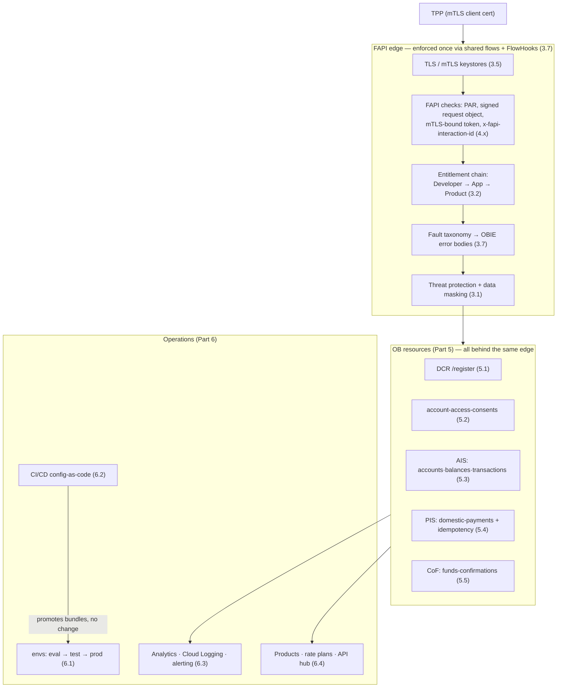

# 7.1 — Capstone: a production-grade OB platform & go-live review

!!! bottomline "Bottom line"
    This is where the whole course comes together. You'll assemble everything — DCR (5.1), consent (5.2), AISP (5.3), PISP (5.4) and CoF (5.5), all behind the FAPI profile (4.x), gated by the entitlement chain (3.2), wrapped in shared flows + FlowHooks + a fault taxonomy (3.7), over TLS/mTLS (3.5), promoted across environments (6.1) by CI/CD (6.2), observed (6.3) and productised (6.4) — into **one operated, regulated Open Banking platform**. Then you'll run a **go-live readiness review**: a scripted set of pass/fail checks that proves the assembled platform is fit to serve real TPPs. The deliverable isn't more features — it's the confidence that what you built is ready.

## Why this exists

Every previous session taught one mechanism in isolation, and each one bridged to something you already knew in Spring — a filter, an interceptor, a `RegisteredClient`, an `@ExceptionHandler`, an idempotency table. That was deliberate: learn the parts against familiar shapes. But a production Open Banking platform is not a pile of parts. It's a **single operated system** where a misconfigured keystore, a missing FlowHook, an un-masked log field, or a rate limit that's wrong by an order of magnitude is the difference between a passing audit and a regulatory incident. The capstone exists to make you assemble the parts and then *interrogate the whole*.

The synthesis matters because the failure modes of a real platform are almost never in a single policy — they're in the **seams**. The token is mTLS-bound (4.4) but the truststore rotated (3.5) and nobody re-pinned it. The fault taxonomy (3.7) is correct in `eval` but the shared flow was never attached via FlowHook in `prod` (6.1). The masking policy (3.1) scrubs the AIS response but not the new CoF one (5.5). None of these show up when you test endpoints one at a time; all of them show up in a go-live review that exercises the assembled surface across the actual promotion path.

So this final session has a different shape from the rest. There's no new Apigee mechanism to learn. Instead you stand back, see the platform as one thing, and run the discipline every regulated launch runs: a **readiness checklist** that says, item by item, *this is safe to turn on*. In a Spring world this is the production-readiness review you'd do before flipping a feature flag for a payments service — except here the surface is regulated, the auditors are real, and "it compiles and the tests pass" is nowhere near enough.

!!! bridge "Spring Boot bridge"
    This is the full system — every Spring-bridge from the course, composed into one operated, regulated platform. Each mechanism you learned against a Spring analogue now sits in the same deployment, and the go-live review is the gateway-scale version of the production-readiness checklist you'd run before launching a Spring payments service.

    | Course concept | Its Spring bridge | Where it lives in the platform |
    |---|---|---|
    | Entitlement chain (3.2) | OAuth client registry + plans table | which TPP product reaches which OB resource |
    | OAuth + JWT + auth-code/PKCE (3.3–3.4) | Spring Authorization Server | the token server the TPP authenticates against |
    | TLS / mTLS (3.5) | `server.ssl` keystore + client truststore | both edges; cert-bound tokens depend on it |
    | Shared flows + FlowHooks + faults (3.7) | `OncePerRequestFilter` + `@ExceptionHandler` | cross-cutting FAPI checks + the error taxonomy |
    | FAPI Advanced (4.x) | the hardening spec around your OAuth | PAR, signed request objects, mTLS-bound tokens |
    | DCR → consent → AIS → PIS → CoF (5.x) | a saga of `@RestController` resources | the regulated journey from 5.5 |
    | Environments + CI/CD (6.1–6.2) | profiles + your app's pipeline | the promotion path bundles travel |
    | Observability + productisation (6.3–6.4) | Micrometer/Actuator + product catalogue | alerting, reports, and consumable products |

    A go-live review is your `@SpringBootTest` smoke suite, your Actuator `/health`, and your pre-launch runbook — fused, and pointed at the *whole* gateway surface rather than one app.

!!! breaks "Where the analogy breaks"
    A Spring production-readiness review covers **one service you own end to end**, deployed as one artifact, observable through one set of metrics. The OB platform is a *federation of regulated obligations* enforced at the edge for callers you don't trust and can't see inside. "It works on my machine" has no meaning here, because the thing being reviewed is partly **trust framework conformance** — does the platform reject a tampered request object, refuse a replayed cert-bound token, honour a revoked consent — not just "does the code run." And readiness isn't a one-time gate: certificates expire, keys rotate, the OBIE specs version, and a passing review decays. Don't treat go-live as a finish line you cross once; treat it as a checklist you can re-run on demand, which is exactly why the lab makes it a script.

## The concept

The assembled platform is best seen as one picture: the OB resources from Part 5, each wrapped by the same FAPI + entitlement + fault machinery from Parts 3–4, deployed across the environments from Part 6. Here is the whole thing in one view — the shared flows and FlowHooks enforce the cross-cutting concerns *once*, and every OB resource inherits them:



Read it top to bottom: a TPP arrives over mTLS, the **edge** (a stack of shared flows attached by FlowHooks) enforces FAPI, entitlement, faults and masking *before any OB resource runs*, and only then does the request reach the DCR/consent/AIS/PIS/CoF resource it asked for. CI/CD promotes the identical bundle through environments; analytics and products wrap the whole surface. The go-live review walks this picture and checks every box is actually ticked **in `prod`**, not just in `eval`.

!!! pitfall "Watch out"
    A green `golive.sh` proves your own assertions pass — it is **not** proof of FAPI conformance. Your smoke test only probes the cases you thought to write; the OBIE/FAPI conformance suite is an external, adversarial harness that probes the ones you didn't. Treat the smoke run as a fast pre-check and run the actual conformance suite before you claim the platform is a regulated participant.

## Hands-on lab

<div class="lab" markdown="1">
#### Lab — run a go-live readiness review

**Prereqs:** `$ORG`, `$ENV` (point it at your **prod-like** environment), `$TOKEN`, `$RUNTIME_HOST` exported, your assembled platform from 5.1–5.5 deployed, and a client cert pair (`client.pem` / `client.key`) for the mTLS leg. This lab runs *checks*, not features — the output is a pass/fail checklist.

**1. The readiness checklist** — the centrepiece. Each item maps to a session and a concrete, testable assertion:

```text
SECURITY HARDENING
  [ ] TLS 1.2+ only, strong ciphers; no plaintext edge            (3.5)
  [ ] mTLS required on token + resource endpoints                 (3.5 / 4.4)
  [ ] data masking on every OB response + Trace                   (3.1)
FAPI CONFORMANCE
  [ ] PAR required; raw authorization request rejected            (4.3)
  [ ] tampered signed request object → fault, not 200             (4.3)
  [ ] cert-bound token replayed from another cert → 401           (4.4)
  [ ] missing x-fapi-interaction-id → fault from the taxonomy     (3.7 / 4.x)
ENTITLEMENT & CONSENT
  [ ] AIS token cannot call PIS or CoF                            (3.2 / 5.x)
  [ ] revoked consent → request rejected at the edge             (5.2)
  [ ] payment replay (same x-idempotency-key) returns original   (5.4)
PERFORMANCE & LIMITS
  [ ] SpikeArrest + product Quota enforced per TPP               (2.6 / 3.2)
  [ ] limits sized for prod, driven by countRef (not hard-coded) (2.6)
RESILIENCE
  [ ] multi-region / HA instance; target health monitoring        (3.6 / 6.1)
  [ ] rollback to previous revision works and is scripted         (1.4 / 6.2)
OBSERVABILITY
  [ ] FAPI error-rate report + alert per API product             (6.3)
  [ ] structured logs to Cloud Logging, sensitive fields masked   (3.1 / 6.3)
OPERATIONAL
  [ ] runbooks for cert rotation, key rotation, consent revoke    (3.5)
  [ ] keystore/truststore rotation tested before expiry           (3.5)
```

**2. A smoke check per OB endpoint** with the full FAPI envelope. Each should return its OB-shaped response; capture pass/fail. Save as `golive.sh`:

```bash
#!/usr/bin/env bash
set -uo pipefail
BASE="https://$RUNTIME_HOST"
PASS=0; FAIL=0
FAPI=(-H "x-fapi-interaction-id: $(uuidgen)" -H "x-fapi-customer-ip-address: 198.51.100.7")
auth=(-H "Authorization: Bearer $AT" --cert client.pem --key client.key)

check () { # name  expected  actual
  if [ "$2" = "$3" ]; then echo "PASS  $1"; PASS=$((PASS+1));
  else echo "FAIL  $1  (want $2, got $3)"; FAIL=$((FAIL+1)); fi
}

# --- OB endpoints reachable with a valid consent-bound token ---
code=$(curl -s -o /dev/null -w '%{http_code}' "${FAPI[@]}" "${auth[@]}" "$BASE/aisp/v3.1/accounts")
check "AIS /accounts reachable" 200 "$code"
code=$(curl -s -o /dev/null -w '%{http_code}' "${FAPI[@]}" "${auth[@]}" -X POST \
       -H 'content-type: application/json' -d '{"Data":{"ConsentId":"cofcon-456","InstructedAmount":{"Amount":"20.00","Currency":"GBP"}}}' \
       "$BASE/cbpii/v1/funds-confirmations")
check "CoF /funds-confirmations reachable" 200 "$code"

# --- shared-flow / FAPI enforcement: a call MISSING x-fapi-interaction-id must be rejected ---
code=$(curl -s -o /dev/null -w '%{http_code}' "${auth[@]}" "$BASE/aisp/v3.1/accounts")
check "missing x-fapi-interaction-id rejected" 400 "$code"

# --- entitlement: an AIS-only token must NOT reach PIS ---
code=$(curl -s -o /dev/null -w '%{http_code}' "${FAPI[@]}" -H "Authorization: Bearer $AIS_ONLY" \
       --cert client.pem --key client.key -X POST "$BASE/pisp/v3.1/domestic-payments")
check "AIS token blocked from PIS" 403 "$code"

# --- rate limit: hammering past the product quota must yield 429 ---
last=0; for i in $(seq 1 50); do
  last=$(curl -s -o /dev/null -w '%{http_code}' "${FAPI[@]}" "${auth[@]}" "$BASE/aisp/v3.1/accounts"); done
check "Quota/SpikeArrest enforced (429 seen)" 429 "$last"

# --- masking: a Trace/log line must not contain a raw PAN/account number ---
masked=$(curl -s "${FAPI[@]}" "${auth[@]}" "$BASE/aisp/v3.1/accounts" | grep -c '"Identification":"08080021325698"' || true)
check "account number not leaked in body" 0 "$masked"

echo "----"; echo "READY: $PASS passed, $FAIL failed"; [ "$FAIL" -eq 0 ]
```

**3. Prove rollback works** (1.4 / 6.2) — readiness includes being able to undo. Capture the current revision, deploy a deliberately broken one, confirm the smoke test fails, then roll back and confirm it passes:

```bash
PREV=$(apigeecli apis listdeploy --name ob-aisp --env "$ENV" --org "$ORG" --token "$TOKEN" | jq -r '.deployments[0].revision')
apigeecli apis deploy --name ob-aisp --rev "$PREV" --env "$ENV" --org "$ORG" --ovr --wait --token "$TOKEN"
./golive.sh && echo "rollback verified — platform healthy on rev $PREV"
```

!!! pitfall "Watch out"
    Rehearse this rollback *before* go-live — an untested rollback is not a rollback. If the first time anyone runs `apis deploy --rev "$PREV"` is during a real prod incident, you're improvising recovery under pressure on a regulated surface. Prove the one-command revert restores a healthy platform now, while it's a drill and not an outage.

**4. Run it against prod** with a freshly minted, consent-bound token and the AIS-only token for the entitlement check:

```bash
export AT="<consent-bound mTLS token>"
export AIS_ONLY="<AIS-scope-only token>"
./golive.sh
```

**What success looks like:** `golive.sh` prints `READY: N passed, 0 failed` and exits `0`, and **every checklist item passes against your assembled platform** — OB endpoints return their OB-shaped responses, the FAPI envelope is enforced, an AIS token is refused at PIS, the quota trips a `429`, no account number leaks, and rollback restores a healthy platform. A single green run is your go-live evidence: not "the code works," but "the regulated surface behaves."
</div>

## Verify it

Run `golive.sh` against **two** environments — your `test` and your `prod` env groups (6.1) — and confirm it passes in both with no bundle change between them. A check that's green in `test` but red in `prod` almost always means a seam: a FlowHook that was never attached in `prod`, a truststore that didn't rotate, or a product that doesn't include the `prod` environment (the entitlement-chain trap from 3.2). That divergence is the single most valuable thing the review surfaces.

Then verify the review is **repeatable and observable**: a failing item should both fail the script *and* show up in your 6.3 analytics as a spike in the relevant FAPI fault, and trigger the alert you built. If a check can fail silently — green script, but the dashboard shows nothing — your observability has a gap, and go-live is not actually ready. Readiness means a regression announces itself.

!!! pitfall "Watch out"
    Two readiness items silently decay if you only check them once. Rotate certs and keys on a schedule **before** expiry — a cert that lapses takes the token endpoint down weeks after a clean launch, and rotating mid-outage is the worst time to discover the runbook is missing. And size rate limits to your *real* expected TPP traffic, not the eval defaults — a quota left at demo values trips `429` on legitimate go-live load.

!!! failure "Common failure modes"
    - **Reviewing `eval`, shipping `prod`.** The platform is hardened in your eval org but the shared flows, keystores, or products were never fully promoted. *(Symptom: `golive.sh` is green in `eval`, red in `prod`, because a FlowHook or truststore didn't travel.)*
    - **Masking that doesn't cover new resources.** The 3.1 mask was written for AIS and never extended to PIS or CoF. *(Symptom: an account number or PAN appears in a CoF Trace or Cloud Logging line.)*
    - **Hard-coded rate limits.** Quotas sized for a demo, not production load, or baked into the proxy instead of driven by `countRef`. *(Symptom: legitimate TPP traffic trips `429` at go-live, or a plan change needs a redeploy.)*
    - **Certificate/key rotation has no runbook.** mTLS and signed request objects depend on certs that expire. *(Symptom: a token endpoint starts failing weeks after launch when a cert silently expires and nobody owns the rotation.)*
    - **Rollback never rehearsed.** The pipeline can deploy but no one has proven it can *undo*. *(Symptom: a bad revision reaches prod and recovery is improvised under pressure instead of being a one-command, tested step.)*
    - **Consent revocation enforced at the backend, not the edge.** *(Symptom: a revoked consent still returns data because the proxy didn't re-check consent state before routing.)*

!!! stretch "Stretch goal"
    Run a subset of the **Open Banking conformance suite** (the OBIE Functional Conformance Tool / the FAPI conformance tests from the OpenID Foundation) against your assembled platform. Start with the FAPI Advanced security tests — they'll independently probe PAR, signed request objects, mTLS-bound tokens and the error responses you built in Part 4 — then add the OBIE functional tests for AIS and PIS. Conformance tooling is the real-world version of `golive.sh`: an external, adversarial checklist that doesn't trust your own assertions. Getting even a slice of it green is the strongest possible evidence the platform is ready to be a regulated participant rather than a demo.

## Recap & next

You assembled the entire course into one platform — **DCR, consent, AIS, PIS and CoF** (Part 5), behind the **FAPI edge** (Part 4), gated by the **entitlement chain** and wrapped in **shared flows, FlowHooks, a fault taxonomy, TLS/mTLS and masking** (Part 3), promoted across **environments by CI/CD** and made **observable and productised** (Part 6) — and then ran a **go-live readiness review** whose every item passes against the real surface. You no longer have a collection of policies; you have an operated, regulated Open Banking platform you can certify on demand.

**You're done.** There is no next session — this was the capstone. Head back to the [course Overview](index.html) to revisit any bridge with fresh eyes, and take the **conformance-suite stretch** above as your real-world finish line: point an external, adversarial test harness at what you built and watch it pass. That's the moment the platform stops being a course project and becomes production-grade.
